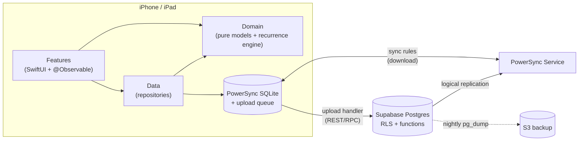

# Decisions — index

**Status:** All accepted. ADR-001 to 010 on 2026-09-25, ADR-011 on 2026-09-29, ADR-012 on 2026-09-30. To change a decision, write a new ADR that supersedes it. Accepted ADRs only get editorial fixes.

| ADR | Decision | Options | Accepted | Hinges on |
|---|---|---|---|---|
| [001](ADR-001-persistence-and-sync.md) | Persistence and sync | A. SQLiteData + CloudKit **B. PowerSync + Supabase** C. Firestore | **B**, and 1b = (i): PowerSync in local-only mode from P1 | R3 + R4: an existing sync tool *and* server-enforced permissions |
| [002](ADR-002-hosting-and-cost.md) | Hosting and cost | **A. Free tiers** B. Supabase Pro C. VPS | **A now, B later**, plus a nightly `pg_dump` to S3 | R2: $10 now, easy to pause |
| [003](ADR-003-identity-model.md) | Identity | **A. Member-centric** B. Account-centric C. Device-centric | **A** | B3, and Sign in with Apple being unavailable under 13 |
| [004](ADR-004-sharing-and-permissions.md) | Sharing and permissions | **A. Personal + household scopes** B. Per-list sharing C. Household only | **A**, with capabilities instead of roles | C1, C2 |
| [005](ADR-005-recurrence-engine.md) | Recurrence engine | A. Materialize **B. Compute on read** C. Hybrid | **B** | Floating schedules, editing history safely |
| [006](ADR-006-day-boundary-and-time-zones.md) | Day boundary and time zones | **A. Logical day stored on each event** B. Home time zone C. Instants only | **A** | D5: the simplest option that keeps history stable |
| [007](ADR-007-events-and-conflicts.md) | Completions and conflicts | A. Mutable, last writer wins **B. Append-only events** C. Event sourcing | **B** | Offline ticks, undo, stats, and the ledger |
| [008](ADR-008-app-structure.md) | App structure | A. Single target **B. SPM packages + `@Observable`** C. B + TCA | **B** | A1: learnable, with enforced boundaries |
| [009](ADR-009-gamification-scope.md) | Gamification | A. Celebrations **B. + points ledger and rewards** C. + game layer | **A in P4, B in P5, C not planned** | F1 |
| [010](ADR-010-household-membership-lifecycle.md) | Household membership lifecycle | A. Owner role + `createdBy` **B. Profile + Membership + capabilities** C. Optional household | **B**, plus HH-01 to HH-07 | Joining and leaving must keep history and personal data intact |
| [011](ADR-011-data-deletion-and-retention.md) | Data deletion and retention | A. Hard-delete now **B. Soft-delete + purge** C. Soft-delete forever | **B**, 30 days for account deletion, 180 days otherwise | Recover from mistakes without breaking privacy law |
| [012](ADR-012-environments-and-release.md) | Environments and release | A. Local + Prod **B. Local + Dev + Prod** C. + staging | **B**, separate app variants, Xcode Cloud from P2, TestFlight for the family | Real devices for testing, without risking family data |

## How they fit together

The full architecture is in [04-architecture.md](../04-architecture.md).
