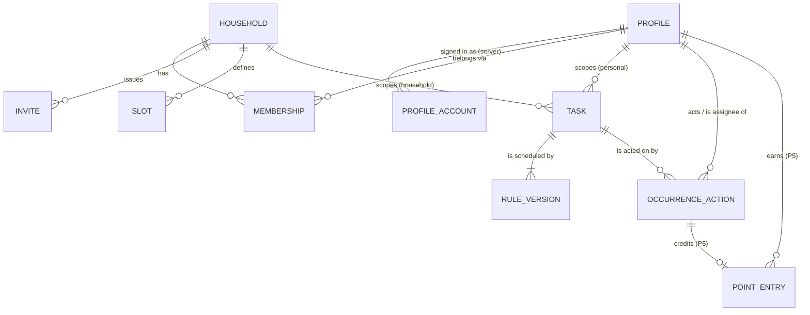

# 03 — Domain model

**Status:** Accepted (2026-09-29). Decisions DM-01 to DM-18 are in [§9](#9-decisions).

**Builds on:** [01-requirements](01-requirements.md), ADR-003 to ADR-007, ADR-010, and ADR-011.

**Worked examples use:** Mon 2026-09-28 to Sun 2026-10-04 and a day start of 05:00. The profile is *Victor* unless another is named.

---

## 1. Vocabulary added to the glossary

| Term | Meaning |
|---|---|
| **Profile** | Someone who uses the app: a name, an avatar, a day start, and their personal tasks and history. It may have no account. |
| **Linked / unlinked profile** | A profile with at least one account / with none (e.g. Leo, who only uses the shared iPad). |
| **Membership** | A profile's place in one household. It holds the capabilities that profile has *in that household*. |
| **Scope** | Who a task belongs to: `personal(profileId)` or `household(householdId)`. |
| **Lane** | A single stream of occurrences, identified by `(task, assignee-or-shared, slot)`. For example: "Brush teeth · Leo · Evening" or "Empty dishwasher · shared · Anytime". Every resolution rule works one lane at a time. |
| **OccurrenceAction** | Something a profile did to an occurrence: `complete`, `skip`, or `snooze`. It's append-only. *ADR-005 and ADR-007 call these "events".* The generic word "event" is kept free for things like analytics later. |
| **Resolving action** | A `complete` or `skip` action that hasn't been revoked. |
| **Rule version** | Everything that decides *which occurrences exist*: the anchor, pattern, slots, miss policy, and assignment. It's versioned by an effective-from date. |
| **Preset** | A friendly name in the UI for a combination of anchor and miss policy (see §5.6). The model has no "habit" or "chore" types. |
| **Revoked vs. deleted** | *Revoked* means undone by the user: it stays in history as "undone". *Deleted* means soft-deleted and waiting to be purged: it's invisible everywhere (ADR-011). |

---

## 2. Entities



Every table below also has `deletedAt?`, the soft-delete marker from ADR-011. It's left out of the field tables.

### 2.1 Household
Every profile is always in exactly one household. A solo user gets a hidden household of one (HH-03).

| Field | Notes |
|---|---|
| `id` | UUID, generated on the client |
| `name` | Solo default: "Home" |
| `createdByProfileId`, `createdAt` | **A record only.** It never grants permissions (ADR-010, invariant 4). |

### 2.2 Profile *(the identity. It moves between households)*

| Field | Notes |
|---|---|
| `id` | UUID |
| `displayName`, `avatarEmoji`, `avatarColor` | Nicknames only (S4) |
| `dayStartMinutes` | Default 300 (05:00) |

`ProfileAccount(profileId, accountId)` is a **server-only** link.
- `accountId` is unique: an account belongs to at most one profile.
- A profile can have several accounts. For example, a kid with two paired devices, or a kid who later links their own Apple Account.
- **The same Apple Account on two devices is one account**, because Sign in with Apple returns the same stable user ID for our app on every device.
- A new account can only be linked to an existing profile through **pairing** (HH-07).

### 2.3 Membership *(profile × household)*

| Field | Notes |
|---|---|
| `id`, `profileId`, `householdId` | |
| `capabilities` | A set of `manageHouseholdTasks`, `manageMembers`, `actForOthers`, `manageRewards` |
| `joinedAt`, `leftAt?` | A membership is **open** while `leftAt` is null. At most one open membership per profile (ADR-010, invariant 1). |

A household can always read every membership it has ever had, including closed ones, and the profiles behind them. That keeps "done by Ana" readable after Ana leaves.

### 2.4 Invite *(P3)*

| Field | Notes |
|---|---|
| `id`, `householdId`, `createdByProfileId` | The creator needs `manageMembers` |
| `code` | Short and single-use. Shared as a link or QR code. |
| `expiresAt`, `usedByProfileId?`, `usedAt?` | |

### 2.5 Slot

| Field | Notes |
|---|---|
| `id`, `householdId` | Slots belong to the household, so board rows line up across profiles |
| `name`, `sortOrder` | Defaults: Morning, Afternoon, Evening |
| `isAnytime` | Exactly one per household. It can't be deleted and always sorts last. |
| `archivedAt?` | |

### 2.6 Task *(the definition. Fields merge last-writer-wins, per ADR-007)*

| Field | Notes |
|---|---|
| `id` | |
| **Scope** | **In the domain it's one value:** `Scope = personal(profileId) \| household(householdId)`. **In storage it's two columns, `ownerProfileId?` and `householdId?`, with a CHECK that exactly one is set** (DM-15). There's no separate `scope` column, because the scope is whichever column is set. Personal tasks have no household, so they follow their owner. |
| `title`, `notes?`, `icon?` | |
| `points` | P5. Default 0 |
| `createdByProfileId`, `createdAt`, `archivedAt?` | *Archiving* is what the user does: it hides the task and keeps its history. *Deleting* only happens through ADR-011. |

### 2.7 RuleVersion *(what makes occurrences exist)*

| Field | Notes |
|---|---|
| `id` | **Deterministic:** `UUIDv5(taskId, effectiveFrom)`. Two devices editing on the same day write the *same row* (§8, C5). |
| `taskId`, `effectiveFrom` | A logical date, always ≥ today when created. The past is never rewritten (FR-18). |
| `anchor` | `fixed` or `floating` |
| `pattern` | See §5.1 |
| `slotIds` | 1 or more. Floating allows exactly 1 (DM-04). |
| `missPolicy` | `vanish`, `markMissed`, or `carryOver`. Floating forces `carryOver` (DM-04). |
| `assignment` | `personal` (implicitly the owner), `each(profileIds)`, or `anyOf(profileIds)` (DM-02) |
| `floatingSeed?` | The first due date when there's no history yet ("when did you last do it?" + N) |

The version **in effect** on date *d* is the one with the greatest `effectiveFrom ≤ d`.

### 2.8 OccurrenceAction *(append-only. Only `revokedAt` and `revokedByProfileId` can be set after creation, plus `deletedAt` by ADR-011)*

| Field | Set by | Notes |
|---|---|---|
| `id` | client | UUID |
| `taskId` | client | |
| Scope (`ownerProfileId?` / `householdId?`) | client | Copied from the task. Used for RLS and sync buckets. |
| `kind` | client | `complete`, `skip`, or `snooze` |
| `slotId`, `assigneeProfileId?` | client | The lane. `assigneeProfileId` is null for `anyOf` lanes. |
| `occurrenceDate` | client | *Which* occurrence the action targets |
| `actedOn` | client | The logical date the action counts for. For `complete`, the day it was done (can be backdated, DM-07). For `skip`, the day the floating clock restarts from. For `snooze`, the day it was snoozed. |
| `actorProfileId` | client | Who performed the action, and for `complete`, who gets the credit. It can differ from the account that submitted it (the shared iPad case). |
| `snoozeUntil?` | client | Snooze only |
| `occurredAt`, `tzId` | client | The UTC instant and the device's time zone. For audit only. The engine never reads them. |
| `recordedByAccountId` | **server** | Filled in from `auth.uid()` |
| `receivedAt` | **server** | Insert time on the server. Tie-break for "up for grabs" (DM-09). |
| `revokedAt?`, `revokedByProfileId?` | client | Undo |

**Misses are never stored.** A miss is the *absence* of a resolving action, computed when reading (ADR-005).

### 2.9 P5 only (so the model is known to fit): PointEntry, Reward, Redemption
- **`PointEntry(id, profileId, amount ±, reason, sourceActionId?)`** is written **by the server**:
  - A trigger adds an entry when a completion is accepted.
  - There's a unique constraint on the occurrence key, so duplicate ticks pay out once.
  - Revoking a completion adds a compensating negative entry.
  - A balance is always `SUM(amount)`.
- **Reward** and **Redemption** follow the same append-only pattern.

### 2.10 Deleting data (ADR-011)
Nothing is hard-deleted when a user acts. Deletion happens in two stages:
1. The row gets `deletedAt` set, and it disappears everywhere at once.
2. A scheduled **purge** later hard-deletes rows past their retention period. The purge is a later phase.

| What | Retention before purge |
|---|---|
| Data from an account the user deleted (FR-33) | **30 days**. The user can cancel by signing back in. Privacy law expects erasure without undue delay. |
| Everything else (empty households, deleted unlinked profiles, data discarded on import) | 180 days |
| Archived tasks, revoked actions | Kept indefinitely: they're history, not deletions |

Backups in S3 expire after 30 days, so purged data really disappears.

---

## 3. Households and membership (ADR-010)

### 3.1 Operations
All operations except *Create* are **online-only server functions**. Each one checks the invariants atomically (HH-05). "Delete" always means soft-delete (§2.10).

| Operation | Who can do it | Effect | Phase |
|---|---|---|---|
| **Create** | Automatic on first launch | A household of one, plus a membership with every capability | P1 |
| **Invite** | Someone with `manageMembers` | Creates a single-use code that expires | P3 |
| **Join** | The person invited (**never the inviter**) | **The profile moves.** Closes the joiner's current membership and opens one in the new household. Their personal tasks get new rule versions, effective today, with slots matched **by name** (falling back to Anytime). Their old household is deleted if nothing is left in it. | P3 |
| **Add unlinked profile** | Someone with `manageMembers` | A new profile plus a membership | P3 |
| **Change capabilities** | Someone with `manageMembers` | Blocked if it would break invariant 2 | P3 |
| **Leave / remove** | The profile itself, or someone with `manageMembers` | Closes the membership. A linked profile gets a fresh household of one and keeps its personal tasks. Household tasks stay, and lanes assigned to the leaver drop out of Today. | P3 |
| **Pair a device** | For a linked profile: one of **its own** accounts. For an unlinked profile: someone with `manageMembers`. | **The device adopts the profile.** The device's account is linked to that profile (HH-07). If the device or account already had its own data, go on to **Import or Discard**. | P4+ |
| **Import or Discard** | Whoever is on the device | **Import:** the previous profile's personal tasks, rule versions, and actions are **copied with new IDs** into the adopted profile (DM-17), with slots matched by name. The originals are deleted. **Discard:** the originals are deleted. Either way, the previous profile and any now-empty household are deleted. | P2 (C8), P4+ (L11–L12) |
| **Delete household** | Nobody directly | Happens when the last linked profile leaves. Its unlinked profiles and household data are deleted, after a clear warning. | P3 |

### 3.2 Invariants
Numbered as in ADR-010:
1. At most one open membership per profile.
2. A household that has any linked profile always has at least one linked profile holding `manageMembers`.
3. An account links to at most one profile.
4. `createdByProfileId` never grants permissions.

Extra rule for unlinked profiles (DM-12): they own only household-scope tasks.

### 3.3 Worked edge cases: lifecycle

| # | Scenario | Result |
|---|---|---|
| L1 | Victor has used the app solo. Ana, also solo until now, invites him. | **Join:** Victor's profile moves. His floss and other personal tasks come along, and his slots are matched by name (both have Morning/Afternoon/Evening). His empty household of one is deleted. |
| L2 | Victor uses the same Apple Account on his iPhone and his iPad | One account, so he's Victor on both. |
| L3 | Victor signs in on another device with a **different** Apple Account | A new account with a **new, separate** profile in its own household of one. It can't claim Victor by signing in. Only a pairing code from one of Victor's existing accounts can link it (HH-07). |
| L4 | Ana (with `manageMembers`) tries to pair a device to Victor's profile | Refused: Victor is linked, so only Victor's own accounts can pair. This stops anyone taking over his profile. |
| L5 | Leo (unlinked) gets his own iPad, which is new and has no data | Victor makes a pairing code for Leo. Leo's iPad adopts the Leo profile, and there's nothing to import. |
| L6 | Ana is the only person with `manageMembers` and tries to leave | Blocked (invariant 2). She has to grant it to Victor first. |
| L7 | Victor is the last linked profile, Leo and Mia remain, and he tries to leave | Blocked (HH-04): invite someone else first, or delete the kids' profiles. |
| L8 | Ana leaves the household | Her membership closes. The household's past actions still show "Ana". Lanes assigned to her drop from Today. Her personal tasks go with her to a new household of one. |
| L9 | Ana deletes her account | Everything of hers is soft-deleted at once, and she's shown as "Former member". It's purged after 30 days, when her name is overwritten. The household's actions are kept (HH-06). If she signs back in within 30 days, the deletion is cancelled. |
| L10 | Victor tries to join Ana's household while offline | The app asks him to connect. Nothing changes locally until the server accepts. |
| L11 | Leo used his iPad **without signing in** for weeks (a local household of one with a "Leo" profile), then redeems the pairing code for the household's Leo | Unlike L1, the device **adopts** the household's Leo profile rather than moving its own. The app offers **Import or Discard**. Import copies the local tasks and history into household Leo. His local profile and household never reached the server, so they're just removed from the device. |
| L12 | Like L11, but Leo (now 13) had **signed in with his own Apple Account**, so a server-side profile and household exist | Pairing links his account to the household's Leo. His old server profile goes through Import or Discard and is then deleted, which keeps invariant 3 (one profile per account). If his old household had other people in it, the normal leave rules apply first (L6, L7). |

---

## 4. Deriving the logical date *(the app shell's only job with time)*

```
wall = now, shown in the device's current time zone
logicalDate = wall.date        if wall.timeOfDay ≥ dayStart
            = wall.date − 1    otherwise
```

- The comparison uses **wall-clock time, not "instant minus 5h"**, so daylight-saving changes can't move the boundary by an hour.
- Everything below this point sees only `LogicalDate` values.
- The engine's date arithmetic is pure Gregorian arithmetic. It never uses a time zone.

---

## 5. Recurrence rules

### 5.1 Patterns

| Pattern | Parameters | Allowed anchors | Due dates (fixed) |
|---|---|---|---|
| `once` | `date?` | fixed | The date, or `effectiveFrom` if it has no date |
| `days` | `every n`, `start` | fixed, floating | `start + k·n` |
| `weeks` | `every n`, `weekdays`, `start` | fixed (floating: `every n` weeks only) | The chosen weekdays in weeks where `weeksSince(start) % n == 0` |
| `months` | `every n`, `day k` *or* `nth weekday`, `start` | fixed (floating: `every n` months only) | Day *k* clamped to the month's length (DM-06), or "the 1st/2nd/3rd/4th/last Sat" |
| `yearly` | Later | | |

`start` belongs to the **pattern**, not the version. Editing the slots of an "every 3 days" task, it doesn't shift which days it lands on.

### 5.2 Which lanes exist on date *d*
Take the version in effect on *d*:
- For each slot in `slotIds`:
  - `personal` → one lane for the owner.
  - `each(ps)` → one lane per profile in `ps` that has an open membership.
  - `anyOf(ps)` → one **shared** lane. Any profile in `ps` can resolve it.

**Today only shows lanes that exist in *today's* version.** If a lane has been removed (a profile unassigned or gone from the household, a slot removed), it drops out of Today, and its history stays readable.

### 5.3 Due dates of a lane
A fixed lane is due on *d* if both of these hold:
- the version in effect on *d* generates *d*, and
- that version still contains the lane.

Due dates therefore only exist from the task's first `effectiveFrom` onward, never before the task was created.

### 5.4 Resolution by miss policy (fixed lanes)

| Policy | Occurrence *d* is resolved when… | An unresolved past *d* is shown as… | Today shows… |
|---|---|---|---|
| `vanish` | there's a resolving action with `occurrenceDate == d` | nothing, and it's neutral in history | today's occurrence, if due |
| `markMissed` | the same as `vanish` | **missed** in history, which breaks the streak | today's occurrence, if due |
| `carryOver` | there's a resolving action with `occurrenceDate ≥ d` **(one tick clears the backlog, DM-03)** | nothing separately: it's folded into one item | **one** item if any due date ≤ today is unresolved |

For a carried-over item:
- `occurrenceDate` = the latest unresolved due date ≤ today. Resolving it resolves everything before it.
- `overdueSince` = the first unresolved due date, i.e. the first due date after the lane's last resolution.
- `daysOverdue` = `today − overdueSince`.

### 5.5 Floating lanes
- `lastResolution` = the greatest `actedOn` among the lane's resolving actions. **Skips count too:** a skip restarts the clock (DM-05).
- `nextDue` = `lastResolution + interval(today's version)`, or `floatingSeed` if there's no history.
- The lane is open when `nextDue ≤ today`, and `daysOverdue = today − nextDue`.
- Changing the interval takes effect right away, because the next due date is always computed from today's version.

### 5.6 Presets *(UI names only. The user can adjust any preset)*

| Preset | Anchor | Miss policy | Example |
|---|---|---|---|
| Habit | fixed | markMissed | Floss, daily, Evening |
| Routine chore | fixed | carryOver | Water plants, Mon/Thu |
| Every so often | floating | carryOver | Change sheets, 7 days |
| Nice to do | fixed | vanish | Stretch, daily |
| To-do | once | carryOver | Renew passport |

### 5.7 Warning level (FR-05)
The engine returns `daysOverdue` and a `nominalPeriod`:

| Pattern | `nominalPeriod` |
|---|---|
| `days n` | n |
| `weeks n` with *k* weekdays | 7n / k |
| `months n` | 30n |
| `once` | 7 |

The UI maps the ratio `r = daysOverdue / nominalPeriod` to a level:

| Level | `r` |
|---|---|
| none | 0 |
| mild | 0 < r < 0.5 |
| strong | 0.5 ≤ r < 1 |
| severe | r ≥ 1 |

The thresholds are presentation settings and can be tuned without touching the model.

### 5.8 Snooze (R5)
- Snooze is only available on `carryOver` and floating lanes (DM-05).
- A snoozed item is hidden while `today < snoozeUntil` **and** there's been no resolving action since the snooze.
- `daysOverdue` keeps counting while it's hidden.
- If there are several snoozes, the latest one that hasn't been revoked wins.

### 5.9 Streaks and averages (FR-21)
- **Streak** (`markMissed` lanes, grouped per task and assignee across slots):
  - Count consecutive due dates, going back from yesterday, where every slot's occurrence was resolved.
  - A date where everything was **skipped** doesn't break the streak and doesn't add to it.
  - Today adds to the streak once it's done. It never breaks the streak while it's still open.
- **Average interval** (floating lanes): the mean gap between the last 5 `actedOn` dates of completions. Skips are left out.

---

## 6. Today, as a function

```
today(viewerProfile, date) =
  for every lane visible to the viewer that exists in today's version:
    fixed vanish/markMissed → an item if today is due
    fixed carryOver         → an item if unresolved due dates ≤ today exist
    floating                → an item if nextDue ≤ today
  minus snoozed items
  plus items resolved by actions with actedOn == today (so today's ticks stay visible, shown checked)
  grouped by slot, in slot sortOrder; Anytime last
```

Which lanes a viewer sees:
- **Personal Today:** my personal lanes, plus household lanes where I'm the assignee or in the `anyOf` set.
- **Household board (P3/P4):** one column per profile with an open membership, all computed with **the viewer's** logical date. Shared `anyOf` lanes appear in a separate "Up for grabs" column.

---

## 7. Worked edge cases: domain

### E1 — Missed days

| Task | Mon | Tue | Wed (today) | What Wed shows |
|---|---|---|---|---|
| Floss (Habit, daily) | ✅ | — | open | "Floss". Tue shows as **missed** in history, and the streak resets to 0. |
| Water plants (Routine, Mon/Thu, carryOver) | — | — | open | One item: "Water plants · overdue since Mon (2 d)", warning level *strong* (r = 2 / 3.5 ≈ 0.57) |
| Stretch (Nice to do, daily) | — | — | open | "Stretch". Mon and Tue are neutral in history. |

On Thu, if the plants still aren't done: one item, overdue since Mon. **Ticking it on Thu resolves Mon and Thu.**

### E2 — Skips

| Scenario | Effect |
|---|---|
| Skip today's floss | Today is resolved. The streak doesn't break and doesn't grow. |
| Skip the carried plants item on Wed | Resolves Mon and everything before it. No credit, no points. |
| Skip the sheets (floating 7 d, due Mon) on Wed | `lastResolution = Wed`, so the next due date is the following Wed. **The clock resets** (DM-05). |
| Snooze the sheets 3 days on Wed | Hidden Thu and Fri. On Sat it's back, and `daysOverdue = 5`: the count kept running. |

### E3 — Changing the rules after history exists

| Change (made Wed) | Result |
|---|---|
| Sheets 7 d → 10 d. Last done the previous Mon, 9 days ago. | `nextDue` = Mon + 10 = Thu. It's no longer overdue. |
| Plants Mon/Thu → Tue/Fri, carried item open since Mon | The new version takes effect Wed. The lane still exists, so the backlog carries over: the item stays open since Mon, and the next due dates are Fri and the following Tue. |
| Floss: add a Morning slot | A new lane (Floss · Morning) starts Wed. The Evening lane's history is untouched. The streak groups the slots per day from Wed onward (§5.9). |
| Trash duty `each(Leo)` → `each(Leo, Mia)` | Mia's lane starts Wed. Leo's lane continues. |
| Dishwasher `each(Leo, Mia)` → `anyOf(Leo, Mia)` | The per-profile lanes end, and any backlog in them drops from Today. One shared lane starts Wed. |
| Sheets floating → fixed every Sat | Fixed due dates exist from Wed onward, so the first one is Sat. The floating overdue state is dropped. |
| Try to make a change effective last week | Not allowed. `effectiveFrom ≥ today`. |

### E4 — Shared and assigned tasks

| Task | Assignment | Mon on the board |
|---|---|---|
| Make bed | `each(Leo)` | In Leo's column only |
| Brush teeth (Morning + Evening) | `each(Leo, Mia)` | 2 lanes × 2 kids = 4 items, each ticked separately |
| Empty dishwasher | `anyOf(Leo, Mia, Victor)` | One item under "Up for grabs". Whoever ticks it closes it for everyone. |
| Change sheets | `anyOf(…)`, floating | One shared clock. Whoever does it restarts the clock. |

An unlinked profile (Leo) owns **only household-scope** tasks (DM-12).

### E5 — Travel and the day boundary

| Scenario | Result |
|---|---|
| Floss ticked Mon 22:00 in São Paulo. Fly east. Land in Tokyo on Wed 08:00 local. | Logical today = Wed. **Tue passed in transit with no tick, so it shows as missed** (DM-08). **Victor fixes it himself** by skipping Tue in the floss history, within the 7-day backfill window. Floss is `markMissed`, so Tue never appears in Today; he'd notice through the broken streak. *Optional P1 polish:* when a streak breaks inside the backfill window, Today shows a one-tap card: "Tue broke your floss streak. Skip Tue?". It's still Victor's action, consistent with DM-08. |
| …and Ana is at home in São Paulo on that Tuesday | **Ana never sees Victor's floss**, because it's personal. On the household board she sees **Victor's column for her Tuesday** (the viewer's date), with his Tue household items open, because he hasn't done them. On Wed, when she's back in step with him, they resolve by their policies: missed, carried over, or vanished. They both look at the same data and each sees it from their own "today". If she has `actForOthers`, she could tick an item for him (e.g. she took the trash out). |
| Floss ticked Mon 21:00 in São Paulo. Fly west to LA, arriving 19:00 local Mon. | Still logical Mon, and Mon's occurrence is already resolved. Nothing is duplicated. |
| Tick floss at 04:30 Tue with day start 05:00 | It counts for **Mon** (`actedOn = Mon`). |
| Change day start 05:00 → 02:00 at 03:00 | Today jumps from Mon to Tue. Actions already recorded keep their stored dates. |
| Partner in Tokyo ticks shared "trash" at their logical Tue, while it's still Mon evening at home | The action targets **Tue**. At home the board (logical Mon) still shows Mon open. Accepted: the partner couldn't have taken the trash out at home anyway. |

### E6 — Undo

| Scenario | Result |
|---|---|
| Untick today's floss | The action gets `revokedAt`, and the item is open again. |
| Untick the sheets (floating) | `lastResolution` falls back to the previous completion, so the sheets are overdue again, with the correct count. |
| Untick the carried plants item that cleared Mon–Wed | The whole backlog reopens: overdue since Mon. |
| "I flossed yesterday but forgot to tick" | Backfill: an action with `occurrenceDate = actedOn = Tue`, allowed within 7 days (DM-07). The streak is repaired. |

---

## 8. Worked edge cases: sync and conflicts

Under ADR-001/007, every device writes locally first. PowerSync uploads the queue in order. The server accepts the writes, enforces RLS, and stamps `receivedAt`.

| # | Scenario | Resolution |
|---|---|---|
| C1 | iPhone and iPad (both offline) tick the **same** floss occurrence | Two completion actions exist. The lane is resolved either way. Streaks and points count occurrences, not actions, so nothing is counted twice. |
| C2 | Leo and Mia both tick the shared dishwasher offline | Both actions exist. **Credit goes to the one with the earliest `receivedAt`** (DM-09). The other shows "also done by Mia". Actions not yet uploaded sort last, with the `id` as a stable tie-break. |
| C3 | iPhone unticks (revokes A1). The iPad, offline, ticks the same occurrence (A2). | After sync, A1 is revoked and A2 is active, so the item is **done**. Correct: someone did tick it. |
| C4 | Two devices revoke the same action | `revokedAt` is only set once. The second revoke changes nothing. |
| C5 | Two devices edit the rules on the same day | They write the same `RuleVersion` id (deterministic), so fields merge **last-writer-wins per field**. PowerSync sends only the changed columns. |
| C6 | Device A changes the plants to Tue/Fri, effective today (Mon). Device B, offline, ticks Mon's occurrence. | B's action targets a date that is no longer due: an **orphan completion**. It stays in history as "extra", and because of the ≥ rule it still resolves earlier backlog. |
| C7 | A task is archived on one device while another ticks it offline | The action is accepted and stays in history. The task stays hidden. |
| C8 | A second device (same Apple Account) created local data before signing in | On sign-in, the server already has Victor's profile, so the device **adopts** it and offers **Import or Discard** (DM-10, §3.1). This is the same mechanism as L11. |
| C9 | The shared iPad records "Leo did it" through the parent's account | The server checks that the account's profile has `actForOthers` in its open membership, then accepts `actorProfileId = Leo`. The server can't verify it was really Leo (ADR-003). |
| C10 | Clock skew: a device's clock is 2 days off | `actedOn` is off by the same amount. Nothing in the engine uses `occurredAt`, and credit uses the server's `receivedAt`, so any damage stays with that one action. |
| C11 | An action is queued offline for a household the profile has since left | The upload is rejected by RLS (no open membership). The app drops it from the queue and tells the user. |

---

## 9. Decisions

All accepted. DM-01 was accepted through HH-03 (ADR-010).

| # | Decision |
|---|---|
| DM-01 | A solo user is in a household of one from first launch |
| DM-02 | Assignment is part of the versioned rule |
| DM-03 | Completing a carried item resolves the whole backlog |
| DM-04 | Floating tasks force `carryOver` and allow exactly one slot |
| DM-05 | Skip restarts a floating clock and snooze doesn't. Snooze only on carryOver/floating tasks. |
| DM-06 | "Monthly on the 31st" is clamped to the last day of the month |
| DM-07 | 7-day backfill window |
| DM-08 | Days skipped by travel count as misses, and are repaired with a backfill skip |
| DM-09 | "Up for grabs" credit goes to the earliest server `receivedAt` |
| DM-10 | Offer Import or Discard when a device or account with data adopts a profile |
| DM-11 | `actForOthers` is a household-wide capability |
| DM-12 | Unlinked profiles own only household tasks |
| DM-13 | Streaks group a task's slots per day |
| DM-14 | `profileIds` and `slotIds` in a rule version are stored as JSON arrays |
| DM-15 | Scope is one `Scope` enum in the domain, stored as two nullable foreign keys with a CHECK that exactly one is set |
| DM-16 | Actions are named `OccurrenceAction`, with `kind` ∈ {complete, skip, snooze}, `actedOn`, and `actorProfileId` |
| DM-17 | Import copies rows with new IDs and deletes the originals, so actions stay append-only |
| DM-18 | Soft-delete, then purge: 30 days for account deletion, 180 days for everything else (ADR-011) |

**Why scope isn't a single `scopeId` column (DM-15):**
- A column that points to one of two tables can't have a real foreign key in Postgres, so the database couldn't guarantee it points at a valid row.
- It wouldn't simplify the important queries. The RLS check is already one expression (`ownerProfileId = me OR householdId = myHousehold`), and a join to `households` would still have to filter by scope.
- The domain still treats the scope as a single value, through the `Scope` enum.
