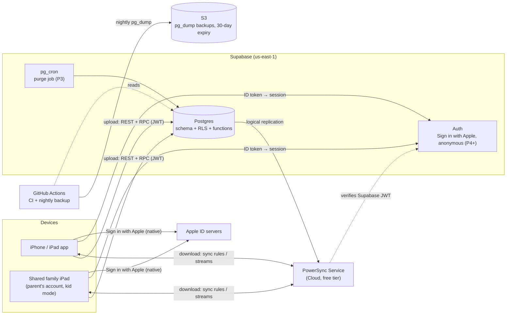
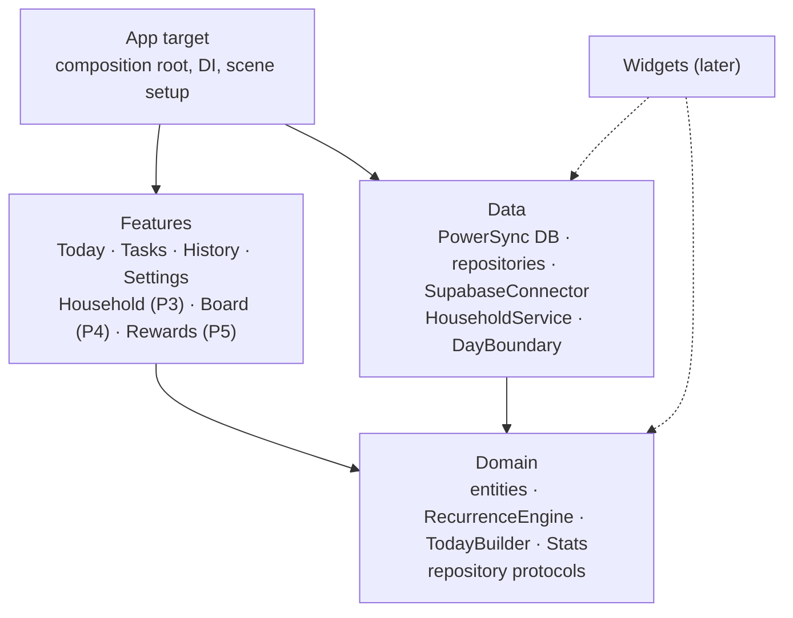
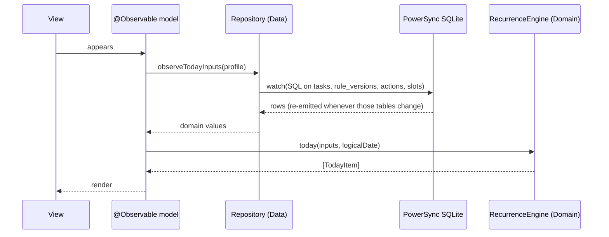
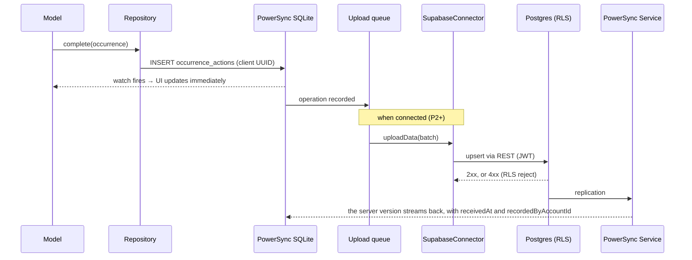

# 04 — Architecture

**Status:** Draft (2026-09-29).
**Builds on:** ADR-001 to ADR-011 and [03-domain-model](03-domain-model.md).

---

## 1. System overview




| Component                     | Role                                                                                                                     | Phase                           |
| ----------------------------- | ------------------------------------------------------------------------------------------------------------------------ | ------------------------------- |
| iOS app                       | All domain logic. A local SQLite database is the source of truth for the UI.                                             | P1                              |
| PowerSync SDK (on the device) | Owns the local SQLite database, watch queries, and the upload queue                                                      | P1 (local-only), P2 (connected) |
| PowerSync Service             | Streams each user's buckets down from Postgres                                                                           | P2                              |
| Supabase Postgres             | The system of record. RLS enforces permissions. Postgres functions run lifecycle operations and write server-set fields. | P2                              |
| Supabase Auth                 | Sign in with Apple (native ID token). Anonymous sessions for paired kid devices.                                         | P2, P4+                         |
| GitHub Actions | Backend CI and deploys, the nightly backup | P0, P2 |
| Xcode Cloud | iOS builds to TestFlight (Dev and Prod variants) | P2 |


---


## 2. Repository layout

```
/ios
  TaskOrganizer.xcodeproj        thin App target (composition root)
  Packages/
    Domain/                      pure Swift, no dependencies
    Data/                        PowerSync, Supabase, repositories
    Features/                    SwiftUI views + @Observable models
/backend
  supabase/
    migrations/                  SQL: schema, RLS, functions, triggers
    tests/                       pgTAP tests (RLS + invariants)
  powersync/
    sync-rules.yaml              bucket definitions
/.github/workflows               CI, nightly backup
/docs                            these documents
```

---


## 3. iOS modules (ADR-008)




**The dependency rule:**

- `Domain` imports nothing, not even SwiftUI.
- `Features` and `Data` import `Domain`, but never each other.
- Only `App` knows every module, and it wires them together.


| Module       | Contains                                                                                                                                                                                                                                                                                                                                  | Doesn't contain                                    |
| ------------ | ----------------------------------------------------------------------------------------------------------------------------------------------------------------------------------------------------------------------------------------------------------------------------------------------------------------------------------------- | -------------------------------------------------- |
| **Domain**   | Value types (`Profile`, `Household`, `Membership`, `Slot`, `Task`, `Scope`, `RuleVersion`, `Pattern`, `OccurrenceAction`, `LogicalDate`). `RecurrenceEngine` (the lanes, due dates, and resolution rules in §5 of the domain model). `TodayBuilder` (§6). `Stats` (streaks, averages). Repository **protocols**. Validation (e.g. DM-04). | I/O, `Date()`, `TimeZone`, `Calendar.current`, SQL |
| **Data**     | PowerSync database setup and client schema. Repository implementations (SQL plus mapping rows to domain types). `SupabaseConnector` (credentials and `uploadData`). `HouseholdService` (the online-only RPCs). `DayBoundary`: current time + time zone + `dayStartMinutes` → `LogicalDate` (§4 of the domain model).                      | Business rules                                     |
| **Features** | One `@Observable` model per screen, which takes repository protocols through its initializer. SwiftUI views. The kid-mode lock (`LocalAuthentication`).                                                                                                                                                                                   | SQL, networking                                    |
| **App**      | Builds concrete repositories and injects them. Owns the PowerSync database's lifetime and connection state.                                                                                                                                                                                                                               | Logic                                              |


**The local database lives in the App Group container from P1.** That costs nothing now, and it lets widgets (later) read the same database without a migration. Each app variant (Dev, Prod) has its own App Group, so their databases never mix ([06 §1](06-environments-and-release.md#1-environments)).

---


## 4. Data flow


### 4.1 Read path (every screen)




- The engine runs on every change. At family scale (hundreds of tasks and a few thousand actions) that takes well under a frame, so there's no cache (ADR-005).
- `logicalDate` comes from `DayBoundary`, and it's re-evaluated when the app comes to the foreground, at each profile's day-start boundary, and when the time zone changes.


### 4.2 Write path: tasks and actions (works offline)




**How the upload handler classifies responses:**


| Response                     | Handling                                                                                                                   |
| ---------------------------- | -------------------------------------------------------------------------------------------------------------------------- |
| 2xx                          | The batch is complete                                                                                                      |
| Network error or 5xx         | Retry with backoff. The batch stays queued.                                                                                |
| 4xx from RLS or a constraint | **Permanent.** Drop the batch, log it, and tell the user (domain model C11). Otherwise the queue would be blocked forever. |


- The client never issues DELETEs. Deletion is a `deletedAt` update (ADR-011).
- Rule-version edits are upserts on a deterministic ID (domain model C5).


### 4.3 Online-only path: household lifecycle (ADR-010, HH-05)

- `Features` calls `HouseholdService`, which calls a Postgres function over RPC, e.g. `join_household(code)`.
- The function checks the invariants inside a single transaction.
- On success, the resulting row changes reach every device through normal sync.
- The UI shows a spinner, and on failure an error. It never shows an optimistic local change.

---


## 5. Sync and sharing


### 5.1 Buckets (what each device downloads)


| Bucket             | Parameter (from the JWT)            | Contents                                                                                                  |
| ------------------ | ----------------------------------- | --------------------------------------------------------------------------------------------------------- |
| `profile`          | The profile linked to `auth.uid()`  | My profile, my personal tasks, their rule versions, my personal actions                                   |
| `household`        | The household of my open membership | The household, its slots, household tasks, rule versions, and actions                                     |
| `household_people` | Same                                | Every membership of the household, open or closed, plus the profiles behind them (names and avatars only) |


- Rows with `deletedAt` set are excluded from every bucket, so they disappear from devices.
- Moving a task between personal and household scope, or joining a household, changes which bucket a row belongs to. PowerSync handles that by re-evaluating bucket membership (to confirm in spike S4).


### 5.2 Write permissions (RLS)


| Table                                        | Insert/update allowed when…                                                                                                                           |
| -------------------------------------------- | ----------------------------------------------------------------------------------------------------------------------------------------------------- |
| `tasks`, `rule_versions` (personal)          | `ownerProfileId` = my profile                                                                                                                         |
| `tasks`, `rule_versions` (household)         | I have an open membership in the household with `manageHouseholdTasks`                                                                                |
| `occurrence_actions` (personal)              | `ownerProfileId` = my profile, and `actorProfileId` = my profile                                                                                      |
| `occurrence_actions` (household)             | I have an open membership, and `actorProfileId` is me or I have `actForOthers`. For `each` lanes, the assignee must be in the rule version in effect. |
| `occurrence_actions` (any)                   | Only `revokedAt`, `revokedByProfileId`, and `deletedAt` can ever be updated                                                                           |
| `slots`, `households` (name)                 | `manageHouseholdTasks`                                                                                                                                |
| `memberships`, `invites`, `profile_accounts` | **Never directly.** Only through lifecycle functions.                                                                                                 |
| `profiles`                                   | My own profile. Unlinked profiles in my household need `manageMembers`.                                                                               |


Fields set by the server (`receivedAt`, `recordedByAccountId`) come from a `BEFORE INSERT` trigger, which ignores whatever the client sends.

### 5.3 Identity flow


| Step                  | Mechanism                                                                                                                                                                                                                                                                                   |
| --------------------- | ------------------------------------------------------------------------------------------------------------------------------------------------------------------------------------------------------------------------------------------------------------------------------------------- |
| First launch (P1)     | A local profile, household, membership, and default slots. No network.                                                                                                                                                                                                                      |
| Sign in (P2)          | Native Sign in with Apple → `signInWithIdToken` → Supabase session → a server function **claims or creates** the profile for this account. If the account already has a profile and the device has local data, the device offers **Import or Discard** (DM-10). Then PowerSync `connect()`. |
| Kid device (P4+)      | Anonymous Supabase session → `redeem_pairing_code(code)` links the anonymous account to the profile (HH-07)                                                                                                                                                                                 |
| Account deletion (P2) | A server function soft-deletes the account's data (ADR-011) and **revokes the Sign in with Apple token**, which the App Store requires for apps that use it.                                                                                                                                |


---


## 6. Cross-cutting concerns


| Concern              | Approach                                                                                                                                                                                                                                   |
| -------------------- | ------------------------------------------------------------------------------------------------------------------------------------------------------------------------------------------------------------------------------------------ |
| **Time**             | Only `DayBoundary` reads the clock or the time zone. Everything else takes a `LogicalDate` (ADR-006). Tests inject the dates they need.                                                                                                    |
| **IDs**              | UUIDv4 generated on the client for every row. UUIDv5(`taskId`, `effectiveFrom`) for rule versions.                                                                                                                                         |
| **Schema evolution** | Postgres: Supabase CLI migrations only, never manual changes in the dashboard. Client: the PowerSync schema is defined in code, and changes are additive. How a new column reaches devices that are already installed is part of spike S1. |
| **Deletion**         | `deletedAt` everywhere. Sync rules and repositories filter it out. A `pg_cron` purge job (P3). S3 lifecycle expiry.                                                                                                                        |
| **Observability**    | `OSLog` on the device, and Supabase logs on the server. No third-party SDKs (S3′).                                                                                                                                                         |
| **Secrets** | Only the Supabase anon key and URLs ship in the app. Everything else lives in CI secrets ([06 §2](06-environments-and-release.md#2-build-configuration)). |
| **Environments** | Local, Dev, and Prod, each with its own backend and app variant ([06](06-environments-and-release.md)) |
| **Compatibility** | Old app builds keep talking to the newest backend. Expand/contract migrations and the `min_supported_build` gate ([06 §5](06-environments-and-release.md#5-backward-compatibility-rules)). |
| **Kid mode lock**    | `LocalAuthentication` (Face ID or the device passcode) guards management screens on the shared iPad (FR-51).                                                                                                                               |


---


## 7. Testing strategy


| Layer   | Tool                                                | What                                                                                                                                                              |
| ------- | --------------------------------------------------- | ----------------------------------------------------------------------------------------------------------------------------------------------------------------- |
| Domain  | Swift Testing, `swift test` (no simulator)          | **Every edge case in domain model §3 and §7 as a table-driven test**, plus property-style tests (e.g. "undoing any action restores the previous `TodayItem` set") |
| Data    | Swift Testing with a temporary PowerSync database   | Repository SQL, row ↔ domain mapping, Import or Discard                                                                                                           |
| Backend | pgTAP (`supabase test db`)                          | RLS allow/deny matrix (§5.2), lifecycle invariants 1–4, trigger-set fields                                                                                        |
| Sync    | A scripted two-simulator scenario (manual at first) | Conflict cases C1–C11                                                                                                                                             |
| CI      | GitHub Actions                                      | Domain tests on every push. Backend tests against a local Supabase in Docker.                                                                                     |

---

## 8. Environments and delivery

How environments, build variants, CI/CD, migrations, and releases work is covered in [06-environments-and-release.md](06-environments-and-release.md). The reasoning is in ADR-012.
