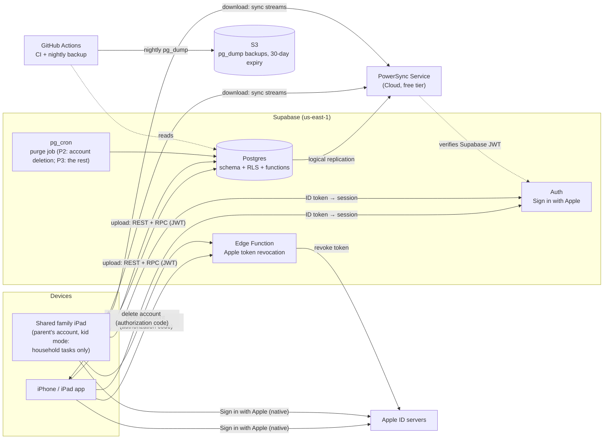
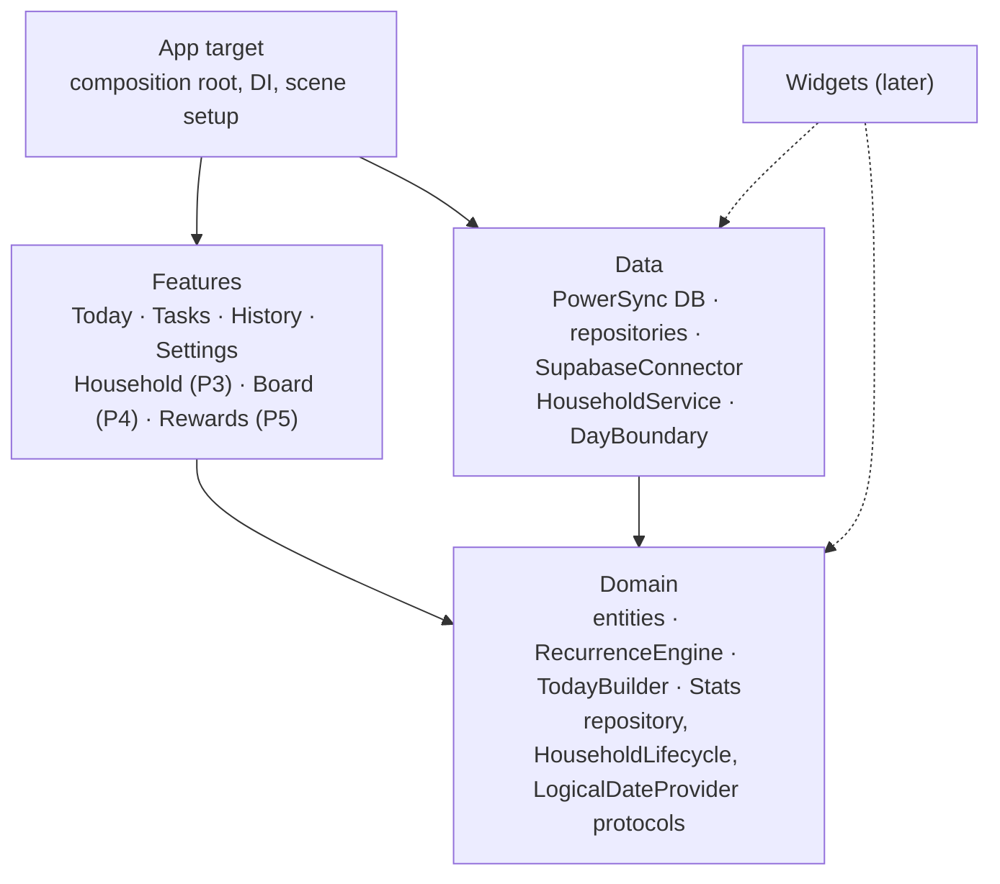
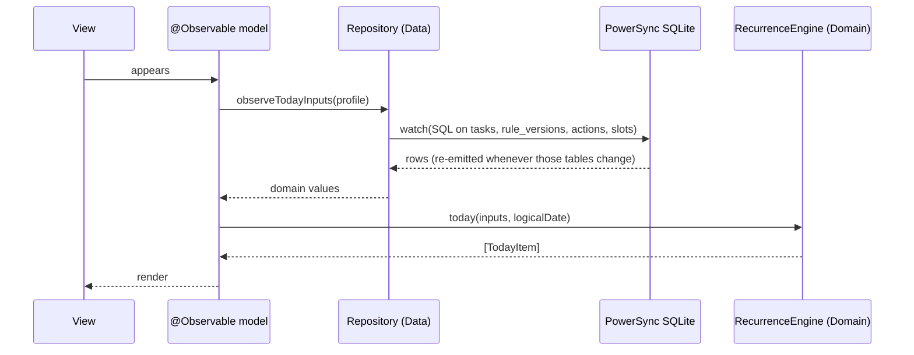
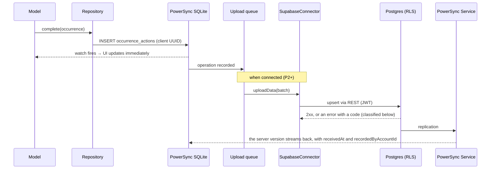

# 04 — Architecture

**Status:** Draft (2026-09-29).
**Builds on:** ADR-001 to ADR-011, ADR-013, and [03-domain-model](03-domain-model.md).

---

## 1. System overview




| Component                     | Role                                                                                                                     | Phase                           |
| ----------------------------- | ------------------------------------------------------------------------------------------------------------------------ | ------------------------------- |
| iOS app                       | All domain logic. A local SQLite database is the source of truth for the UI.                                             | P1                              |
| PowerSync SDK (on the device) | Owns the local SQLite database, watch queries, and the upload queue                                                      | P1 (local-only), P2 (connected) |
| PowerSync Service             | Streams each user's buckets down from Postgres                                                                           | P2                              |
| Supabase Postgres             | The system of record. RLS enforces permissions. Postgres functions run lifecycle operations and write server-set fields. | P2                              |
| Supabase Auth                 | Sign in with Apple (native ID token)                                                                                     | P2                              |
| Supabase Edge Function        | Revokes the Sign in with Apple token when an account is deleted (§5.3). The `.p8` key it signs with is a Supabase secret. | P2                              |
| GitHub Actions | Backend CI and deploys, the nightly backup | P0, P2 |
| Xcode Cloud | iOS builds to TestFlight (Dev and Prod variants) | P2 |


---


## 2. Repository layout

```
/ios
  TaskOrganizer.xcodeproj        thin App target (composition root)
  Packages/
    Domain/                      pure Swift, no dependencies
    Data/                        PowerSync, Supabase, repositories
    Features/                    SwiftUI views + @Observable models
/backend
  supabase/
    migrations/                  SQL: schema, RLS, functions, triggers
    tests/                       pgTAP tests (RLS + invariants)
    functions/                   Edge Functions (Apple token revocation)
  powersync/
    sync-streams.yaml            bucket definitions (Sync Streams, §5.1)
/.github/workflows               CI, nightly backup
/docs                            these documents
```

---


## 3. iOS modules (ADR-008)




**The dependency rule:**

- `Domain` imports nothing, not even SwiftUI.
- `Features` and `Data` import `Domain`, but never each other.
- Only `App` knows every module, and it wires them together.


| Module       | Contains                                                                                                                                                                                                                                                                                                                                  | Doesn't contain                                    |
| ------------ | ----------------------------------------------------------------------------------------------------------------------------------------------------------------------------------------------------------------------------------------------------------------------------------------------------------------------------------------- | -------------------------------------------------- |
| **Domain**   | Value types (`Profile`, `Household`, `Membership`, `Slot`, `Task`, `Scope`, `RuleVersion`, `Pattern`, `OccurrenceAction`, `LogicalDate`). `RecurrenceEngine` (the lanes, due dates, and resolution rules in §5 of the domain model). `TodayBuilder` (§6). `Stats` (streaks, averages). **Protocols** that `Data` implements: the repositories, `HouseholdLifecycle` (the online-only lifecycle operations), and `LogicalDateProvider` (today's `LogicalDate`). Validation (e.g. DM-04). | I/O, `Date()`, `TimeZone`, `Calendar.current`, SQL |
| **Data**     | PowerSync database setup and client schema. Repository implementations (SQL plus mapping rows to domain types). `SupabaseConnector` (credentials and `uploadData`). `HouseholdService`, which implements `HouseholdLifecycle` with the online-only RPCs. `DayBoundary`, which implements `LogicalDateProvider`: current time + time zone + `dayStartMinutes` → `LogicalDate` (§4 of the domain model).                      | Business rules                                     |
| **Features** | One `@Observable` model per screen, which takes `Domain` protocols (repositories, `HouseholdLifecycle`, `LogicalDateProvider`) through its initializer. SwiftUI views. Kid mode and its lock: the parent PIN, with optional Face ID through `LocalAuthentication` (§6).                                                                                                                                                                                   | SQL, networking                                    |
| **App**      | Builds concrete repositories and injects them. Owns the PowerSync database's lifetime and connection state.                                                                                                                                                                                                                               | Logic                                              |


**The local database lives in the app's own container, not the App Group, until widgets are built.** A shared container isn't free:

- iOS terminates a suspended app that holds a SQLite lock on a file in a shared container (`0xdead10cc`) ([reports](https://mjtsai.com/blog/2025/05/15/sqlite-databases-in-app-group-containers-dont/)).
- PowerSync's App Group support is experimental, and it doesn't allow concurrent writes from several processes ([docs](https://docs.powersync.com/client-sdks/reference/swift)).

Moving the database into the App Group is part of the widgets work (Later). Each app variant (Dev, Prod) has its own bundle ID, so their databases never mix ([06 §1](06-environments-and-release.md#1-environments)).

---


## 4. Data flow


### 4.1 Read path (every screen)




- The engine runs on every change. At family scale (about 60 tasks and 10–20k actions a year, ADR-002) that takes well under a frame, so there's no cache (ADR-005).
- **The Today query never loads the full history.** For each lane it loads the latest resolution, the latest snooze that hasn't been revoked, and every action in the 7-day backfill window (DM-07). A performance test with 5 years of seeded actions covers it (§7).
- `logicalDate` comes from `LogicalDateProvider` (`DayBoundary` in `Data`). It's re-evaluated when the app comes to the foreground, at each profile's day-start boundary, and when the time zone changes, and it never goes backwards (domain model §4).


### 4.2 Write path: tasks and actions (works offline)




**How the upload handler classifies errors.** It keys on the Postgres SQLSTATE or the PostgREST error `code` in the response body, not on the HTTP status: a 401 can be an expired JWT or an RLS denial on an anonymous request, and a 400 can be a bad value or an unknown column ([PostgREST errors](https://postgrest.org/en/stable/references/errors.html)).


| Response                                                                                         | Handling                                        |
| ------------------------------------------------------------------------------------------------ | ----------------------------------------------- |
| 2xx                                                                                              | The operation is complete                       |
| JWT error (`PGRST301`, `PGRST303`)                                                               | Refresh the session, then retry                 |
| 429, 5xx, or a network error                                                                     | Retry with backoff. The operation stays queued. |
| `42501` (RLS), `23xxx` (constraint), `22xxx` (bad value), or any other code, e.g. `PGRST204` (unknown column) | **Permanent** (below)                           |


**On a permanent error**, only the failing operation (or its transaction) leaves the queue, never the whole batch, and the rest of the batch uploads. The dropped operation is copied into a local-only `rejected_writes` table, which survives restarts and which the app shows (domain model C11). Without this, one bad row would either block the queue forever or take valid writes down with it.

- The client never issues DELETEs. Deletion is a `deletedAt` update (ADR-011).
- Before uploading, the connector rewrites queued operations that are still in an old shape ([06 §5](06-environments-and-release.md#5-backward-compatibility-rules)).
- A `PUT` is uploaded as a **full-row upsert with explicit nulls**. PowerSync's `PUT` [carries only the non-null columns](https://docs.powersync.com/handling-writes/handling-update-conflicts), so the connector fills in every missing column as null itself. A `PATCH` sends only the changed columns.
- Rule-version edits are upserts on a deterministic ID (domain model C5).


### 4.3 Online-only path: household lifecycle (ADR-010, HH-05)

- `Features` calls the `HouseholdLifecycle` protocol. Its implementation in `Data`, `HouseholdService`, calls a Postgres function over RPC, e.g. `join_household(code, logicalDate)`.
- **Every lifecycle RPC takes the caller's `logicalDate`.** Only the device knows the logical date (domain model §4), so a function that writes rule versions makes them effective that date.
- The function checks the invariants inside a single transaction. Rows it creates, such as a fresh household of one, get server-generated IDs (§6).
- On success, the resulting row changes reach every device through normal sync.
- The UI shows a spinner, and on failure an error. It never shows an optimistic local change.

---


## 5. Sync and sharing


### 5.1 Buckets (what each device downloads)

Downloads are defined with PowerSync **Sync Streams**, in `backend/powersync/sync-streams.yaml`. Sync Rules are [deprecated](https://docs.powersync.com/sync/rules/overview) and [don't support joins](https://docs.powersync.com/sync/rules/many-to-many-join-tables), which the parameter chain below (account → profile → open membership → household) needs. Spike S2 confirms that chain ([05](05-roadmap.md#riskiest-unknowns-spike-first)). RLS doesn't apply to downloads: the streams alone decide what each device gets, and the download isolation test (§7) checks them.


| Bucket             | Parameter (from the JWT)            | Contents                                                                                                  | Phase                                          |
| ------------------ | ----------------------------------- | --------------------------------------------------------------------------------------------------------- | ---------------------------------------------- |
| `profile`          | The profile linked to `auth.uid()`  | My profile, my personal tasks, their rule versions, my personal actions                                   | P2                                             |
| `household`        | The household of my open membership | The household, its slots, household tasks, rule versions, and actions                                     | P2: the household row and its slots. P3: the rest. |
| `household_people` | Same                                | Every membership of the household, open or closed. For open ones, the profiles behind them (names and avatars only). For closed ones, only the leaver snapshot on the membership (domain model §2.3). | P2: my own membership. P3: the rest.           |


- **P2 ships the parts marked P2**, so a second device gets the slots its personal tasks point at, and Import or Discard can match slots by name (domain model C8).
- Rows with `deletedAt` set are excluded from every bucket, so they disappear from devices.
- Moving a task to the household (*Change task scope*, domain model §3.1), or joining a household, changes which bucket a row belongs to. PowerSync handles that by re-evaluating bucket membership (to confirm in spike S2).


### 5.2 Permissions (RLS)

**Read (SELECT) policies** mirror the buckets in §5.1:


| Table                                                         | Select allowed when…                                                                                          |
| ------------------------------------------------------------- | ------------------------------------------------------------------------------------------------------------- |
| `profiles`                                                    | My own profile, or a profile with an **open** membership in the household of my open membership. Closed memberships carry a snapshot instead (domain model §2.3). |
| `households`, `slots`                                         | The household of my open membership                                                                           |
| `memberships`                                                 | Any membership, open or closed, of the household of my open membership                                        |
| `tasks`, `rule_versions`, `occurrence_actions` (personal)     | `ownerProfileId` = my profile                                                                                 |
| `tasks`, `rule_versions`, `occurrence_actions` (household)    | `householdId` = the household of my open membership                                                           |
| `invites`, `profile_accounts`                                 | **Never directly.** Only through lifecycle functions.                                                         |


**Read policies don't filter on `deletedAt`.** Sync streams and repositories do that instead. A PostgREST update reads the updated row back, and that row must still pass the SELECT policies ([Postgres](https://www.postgresql.org/docs/current/sql-createpolicy.html); Supabase also [requires a SELECT policy](https://supabase.com/docs/guides/database/postgres/row-level-security) for any UPDATE), so a policy that hid deleted rows would reject every soft delete with `42501`. If a policy ever has to filter `deletedAt`, soft deletes for that table go through a SECURITY DEFINER function instead.

**Write (INSERT/UPDATE) policies:**


| Table                                        | Insert/update allowed when…                                                                                                                           |
| -------------------------------------------- | ----------------------------------------------------------------------------------------------------------------------------------------------------- |
| `tasks`, `rule_versions` (personal)          | `ownerProfileId` = my profile                                                                                                                         |
| `tasks`, `rule_versions` (household)         | I have an open membership in the household with `manageHouseholdTasks`                                                                                |
| `occurrence_actions` (personal)              | `ownerProfileId` = my profile, and `actorProfileId` = my profile                                                                                      |
| `occurrence_actions` (household)             | I have an open membership, and `actorProfileId` is me or I have `actForOthers`. The assignee isn't checked against the rule version in effect, so offline orphan ticks are kept (domain model C6, C7). |
| `slots`, `households` (name)                 | `manageHouseholdTasks`                                                                                                                                |
| `memberships`, `invites`, `profile_accounts` | **Never directly.** Only through lifecycle functions.                                                                                                 |
| `profiles`                                   | My own profile. Unlinked profiles in my household need `manageMembers`.                                                                               |


**Rules RLS can't express**, because it works on rows, not columns. A `BEFORE UPDATE` trigger on `occurrence_actions` enforces both:

- Only `revokedAt`, `revokedByProfileId`, `deletedAt`, and `deletionId` can ever change, except the scope columns when *Change task scope* rewrites them (domain model §3.1). (Column grants could enforce this one too.)
- `revokedAt` is set only once (domain model C4).

Fields set by the server (`receivedAt`, `recordedByAccountId`) come from a `BEFORE INSERT` trigger, which ignores whatever the client sends.

**Writing policies:** wrap `auth.uid()` in a `select` so it's evaluated once per statement, index every column a policy filters on, and look up memberships through a SECURITY DEFINER helper function ([Supabase RLS guide](https://supabase.com/docs/guides/database/postgres/row-level-security)).

### 5.3 Identity flow


| Step                  | Mechanism                                                                                                                                                                                                                                                                                   |
| --------------------- | ------------------------------------------------------------------------------------------------------------------------------------------------------------------------------------------------------------------------------------------------------------------------------------------- |
| First launch (P1)     | A local profile, household, membership, and default slots. No network.                                                                                                                                                                                                                      |
| Sign in (P2)          | Native Sign in with Apple → `signInWithIdToken` → Supabase session → a server function **claims or creates** the profile for this account. If the account is within its 30-day deletion period, claiming it restores the account's data (domain model §3.1, *Delete account*). When it creates one, it keeps the device's profile, household, membership, and slot IDs. If the account already has a profile and the device has local data, the device offers **Import or Discard** (DM-10), and none of the device's pre-sign-in rows upload. Then PowerSync `connect()`. **The `households` and `memberships` rows created before sign-in never go through the upload queue:** either P1 stores them in local-only tables that are copied at sign-in, or the connector clears their queued entries instead of uploading them. Spike S1 decides which. After sign-in, household renames upload as usual (§5.2). |
| Sign out / switch account (P2) | If writes are still queued, they're uploaded first when online. When offline, sign-out is blocked, with an explicit "Sign out and lose N changes" override. If there are rejected writes (§4.2), the confirmation also says how many will be lost, online or offline, because `clearLocal` wipes them too. Then PowerSync `disconnectAndClear()`, with `clearLocal` left on and not a `soft` clear, which would keep internal copies of synced data ([PowerSync Swift](https://docs.powersync.com/client-sdks/reference/swift)). The device is back in the first-launch state: a fresh local household of one. If someone signs in on it later, **Import or Discard** handles whatever was created in the meantime. Sign-out isn't available in kid mode. |
| Kid device (Later)    | Anonymous Supabase session → `redeem_pairing_code(code)` links the anonymous account to the profile (HH-07)                                                                                                                                                                                 |
| Account deletion (P2) | The app prompts Sign in with Apple again, which returns a fresh authorization code. A server function soft-deletes the account's data (domain model §3.1, *Delete account*). The **Edge Function** exchanges the code with Apple for a token, using a client secret signed with the team's `.p8` key, and **[revokes the token](https://developer.apple.com/documentation/signinwithapplerestapi/revoke-tokens)**, which the App Store requires for apps that use Sign in with Apple. The Supabase auth user is kept until the purge, because Supabase [can't undo deleting a user](https://supabase.com/docs/reference/javascript/auth-admin-deleteuser) and signing back in must still cancel the deletion. Then the device runs `disconnectAndClear()`, as at sign-out. |


---


## 6. Cross-cutting concerns


| Concern              | Approach                                                                                                                                                                                                                                   |
| -------------------- | ------------------------------------------------------------------------------------------------------------------------------------------------------------------------------------------------------------------------------------------ |
| **Time**             | Only `DayBoundary` reads the clock or the time zone. Everything else takes a `LogicalDate` (ADR-006). Tests inject the dates they need.                                                                                                    |
| **IDs**              | UUIDv4 generated on the client for every row the client writes. UUIDv5(`taskId`, `effectiveFrom`) for rule versions, wherever they're written. Server functions and triggers generate UUIDs for the rows they create, such as a fresh household of one on remove, or a P5 `PointEntry` (ADR-013). Claim-or-create is the exception: it keeps the device's IDs (§5.3). |
| **Schema evolution** | Postgres: Supabase CLI migrations only, never manual changes in the dashboard. Client: the PowerSync schema is defined in code, and changes are additive. How a new column reaches devices that are already installed is part of spike S1. |
| **Deletion**         | `deletedAt` everywhere. Sync streams and repositories filter it out; RLS doesn't (§5.2). A `pg_cron` purge job: its account-deletion part in P2, the rest in P3. S3 lifecycle expiry.                                                         |
| **Observability**    | `OSLog` on the device, and Supabase logs on the server. No third-party SDKs (S3′).                                                                                                                                                         |
| **Secrets** | Only the Supabase publishable key (`sb_publishable_…`) and URLs ship in the app. Everything else lives in CI secrets ([06 §2](06-environments-and-release.md#2-build-configuration)). |
| **Environments** | Local, Dev, and Prod, each with its own backend and app variant ([06](06-environments-and-release.md)) |
| **Compatibility** | Old app builds keep talking to the newest backend. Expand/contract migrations and the `min_supported_build` gate ([06 §5](06-environments-and-release.md#5-backward-compatibility-rules)). |
| **Kid mode lock**    | A parent turns kid mode on for a device (FR-50, FR-51). Leaving it needs an app-specific **parent PIN**, stored as a salted hash in that device's Keychain, with growing delays after failed attempts. [`.deviceOwnerAuthentication`](https://developer.apple.com/documentation/localauthentication/lapolicy/deviceownerauthentication) isn't used, because it falls back to the device passcode, which the kids may know. Face ID can be an opt-in shortcut through [`.deviceOwnerAuthenticationWithBiometrics`](https://developer.apple.com/documentation/localauthentication/lapolicy/deviceownerauthenticationwithbiometrics), whose fallback button hands control back to the app, which then asks for the PIN. It's offered only if no child's face is enrolled on that device. Forgotten PIN: delete and reinstall the app; a signed-in device re-syncs everything from the server. |


---


## 7. Testing strategy


| Layer   | Tool                                                | What                                                                                                                                                              |
| ------- | --------------------------------------------------- | ----------------------------------------------------------------------------------------------------------------------------------------------------------------- |
| Domain  | Swift Testing, `swift test` (no simulator)          | **Every edge case in domain model §3 and §7 as a table-driven test**, plus property-style tests (e.g. "undoing any action restores the previous `TodayItem` set") |
| Data    | Swift Testing with a temporary PowerSync database   | Repository SQL, row ↔ domain mapping, Import or Discard. A performance test of the Today query (§4.1) with 5 years of seeded actions.                             |
| Backend | pgTAP (`supabase test db`)                          | RLS allow/deny matrix (§5.2), lifecycle invariants 1–4, trigger-set fields                                                                                        |
| Sync    | A scripted two-simulator scenario (manual at first, automated before P3) | Conflict cases C1–C11                                                                                                                                             |
| Downloads | A script against the local PowerSync Service (Docker) | **Download isolation:** with two households, neither downloads any of the other's rows. RLS doesn't cover downloads (§5.1), so this is their only test. |
| CI      | GitHub Actions                                      | Domain tests on every push. Backend tests against a local Supabase in Docker.                                                                                     |

---

## 8. Environments and delivery

How environments, build variants, CI/CD, migrations, and releases work is covered in [06-environments-and-release.md](06-environments-and-release.md). The reasoning is in ADR-012.
