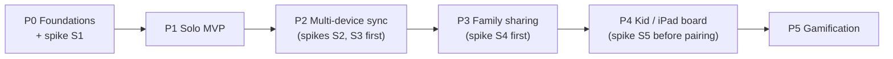

# 05 — Roadmap

**Status:** Draft (2026-09-29).

- Pace is open-ended, so phases have **exit criteria, not dates**.
- Sizes are relative: S, M, L.
- Every phase ends with the app in daily use. A phase is only done when it has held up in real use.

---

## Riskiest unknowns (spike first)

Each spike is **time-boxed**, has a clear pass/fail, and has a fallback. Throwaway code is fine.

| #      | Unknown                                                                                                                                                                                                                                                                                     | Before       | Pass looks like                                                                                                                       | If it fails                                                |
| ------ | ------------------------------------------------------------------------------------------------------------------------------------------------------------------------------------------------------------------------------------------------------------------------------------------- | ------------ | ------------------------------------------------------------------------------------------------------------------------------------- | ---------------------------------------------------------- |
| **S1** | **PowerSync in local-only mode as the P1 store.** Watch queries in SwiftUI. How schema changes reach installed apps. **Are writes made before sign-in uploaded after** `connect()`**, or must they be copied from local-only tables?** (PowerSync documents a pattern for the second case.) | P1           | A small app with 2 tables survives a schema change and an app relaunch. The answer to the sign-in question is known and written down. | ADR-001 sub-decision (ii): GRDB for P1, migrate in P2      |
| **S2** | **End-to-end sync:** Supabase + PowerSync free tiers, sync rules driven by the JWT (profile → membership → household), RLS rejecting an upload (C11), `deletedAt` filtering, **upserting a deterministic rule-version ID** (C5), and two simulators offline then reconnected                | P2           | C1, C3, C5, and C11 behave as documented                                                                                              | Revisit ADR-001 (option A, CloudKit, is the fallback)      |
| **S3** | **Sign in with Apple → Supabase:** native ID token, revoking the token on account deletion, the free tiers pausing and reactivating, and the `pg_dump` → S3 workflow                                                                                                                        | P2           | Sign-in on a real device. Deletion revokes the token. The backup restores into a throwaway local database (06 §7).                                       | Move to Supabase Pro earlier (ADR-002 B)                   |
| **S4** | **Rows changing buckets:** a task moving personal → household, and a profile joining another household                                                                                                                                                                                      | P3           | The devices of both the old and new bucket converge, with nothing left behind or duplicated                                           | Model a scope change as copy + delete, like Import (DM-17) |
| **S5** | **Pairing:** anonymous auth + a redeem function, and whether an anonymous session survives app updates                                                                                                                                                                                      | P4 (pairing) | A paired iPad keeps working across app updates and reboots                                                                            | Pair the device with a family-owned Apple Account instead  |

The **recurrence engine** is the heart of the app, but it isn't a *technical* unknown: it's pure code with a written specification. It's the first thing built in P1, tests first.

---

## P0 — Foundations *(S)*

| In                                                                                                                                                                 | Out                         |
| ------------------------------------------------------------------------------------------------------------------------------------------------------------------ | --------------------------- |
| Repository and the layout from architecture §2. The Xcode project with `Domain`, `Data`, and `Features` packages. **The two app variants** (Dev and Prod: bundle IDs, App Groups, icons, settings files, and schemes from 06 §2), with `<BUNDLE_PREFIX>` fixed in 06. The local Supabase stack and seed data (06 §3). CI running `swift test` on Domain. **Spike S1.** | Any UI beyond a placeholder |

**Exit:** CI is green on an empty Domain test. The Dev and Prod variants install side by side on one device. S1 has been decided either way, and the outcome is recorded in ADR-001.

---

## P1 — Solo MVP *(L)*

| In                                                                                                                                                                                                                                                                                                                                                            | Out                                                                                        |
| ------------------------------------------------------------------------------------------------------------------------------------------------------------------------------------------------------------------------------------------------------------------------------------------------------------------------------------------------------------- | ------------------------------------------------------------------------------------------ |
| A household of one created automatically. Default slots, which can be renamed and reordered. **Tasks with every P1 pattern and preset** (§5.1 and §5.6 of the domain model). Today view with carry-over warnings. Tick, untick, skip, snooze, and backfill (7 days). History with streaks and averages. A day-start setting. Local database in the App Group. | Accounts, sync, household UI, widgets, notifications, yearly/seasonal tasks, the purge job |

**Build order:**

1. **Domain engine with tests E1–E6**
2. Repositories
3. Today view
4. Task editor
5. History

**Exit (the minimum that proves it works):**

- All the domain model's E1–E6 cases pass as unit tests.
- It's been in **daily personal use on one iPhone for 2 weeks** with no data loss, including across at least one schema change.

**Note:** apps installed on a device through a free Apple developer account expire after 7 days. Join the **paid Apple Developer Program** by the end of P1: TestFlight and Sign in with Apple (P2) need it anyway.

---

## P2 — Multi-device sync *(L)*

| In                                                                                                                                                                                                                                                                                                                                                                                                                                                                            | Out                                                              |
| ----------------------------------------------------------------------------------------------------------------------------------------------------------------------------------------------------------------------------------------------------------------------------------------------------------------------------------------------------------------------------------------------------------------------------------------------------------------------------- | ---------------------------------------------------------------- |
| **Spikes S2 and S3.** The dev and prod Supabase projects and PowerSync instances. **The delivery pipeline from 06 §4:** PR checks, deploys to dev on merge, deploys to prod on a tag with approval, Xcode Cloud builds. The `app_config` table with the `min_supported_build` gate (06 §5). Migrations for the personal scope (profiles, households, memberships, slots, tasks, rule versions, actions) + RLS + triggers. PowerSync personal bucket. Sign in with Apple. `connect()`. The upload handler with error classification. **Import or Discard** on a second device (C8). Soft account deletion + token revocation (FR-33). Nightly backup to S3 with 30-day expiry. pgTAP tests for the personal RLS. | Household sharing, invites, the purge job (nothing to purge yet) |

**Exit:**

- iPhone and iPad, **both edited offline, converge** (a C1–C7 script).
- Account deletion works end to end.
- **A restore from backup into a throwaway local database has been rehearsed once** (06 §7).
- At least one change has gone all the way from branch → Dev → Prod through the pipeline.
- Two weeks of use across two devices.

---

## P3 — Family sharing *(L)*

| In                                                                                                                                                                                                                                                                                                                                                                                                                | Out                                            |
| ----------------------------------------------------------------------------------------------------------------------------------------------------------------------------------------------------------------------------------------------------------------------------------------------------------------------------------------------------------------------------------------------------------------- | ---------------------------------------------- |
| **Spike S4.** Lifecycle functions: invite, join, leave/remove, change capabilities, add unlinked profile. Invariants 1–4 in the database. Household tasks with `each` and `anyOf` assignment. Household bucket. Merged Today (FR-46). A simple household board (FR-47). The personal/household choice once there are 2 or more memberships (HH-03). The purge job (ADR-011). pgTAP tests for the full RLS matrix. | Kid-mode lock, pairing, rotation, celebrations |

**Exit:**

- **Two adults on separate Apple Accounts** have run a real household for 2 weeks.
- L1–L10 and C2, C9, and C11 have been verified.
- The RLS test matrix is green.

---

## P4 — Kid / iPad board *(M)*

| In                                                                                                                                                                                                                                                      | Out             |
| ------------------------------------------------------------------------------------------------------------------------------------------------------------------------------------------------------------------------------------------------------- | --------------- |
| Shared-device mode: profile picker ("Who's playing?"), large tap targets, the lock on management actions (FR-51), and celebrations when a slot or day is complete (FR-52). **Then, as P4b:** spike S5 and pairing a kid's device (FR-53, L5, L11, L12). | Points, rewards |

**Exit:** the kids tick their own routines on the shared iPad for 2 weeks without adult help, and no management action can be reached without the lock.

---

## P5 — Gamification *(M)*

| In                                                                                                                                                                                                     | Out                                                            |
| ------------------------------------------------------------------------------------------------------------------------------------------------------------------------------------------------------ | -------------------------------------------------------------- |
| Points per task (default 0). A `PointEntry` ledger written by a server trigger (one payout per occurrence, and a compensating entry on revoke). Rewards and redemptions. A cooperative household goal. | Leaderboards (a non-goal), a persistent game layer (ADR-009 C) |

**Exit:**

- A weekly family goal has been reached and redeemed.
- For every profile, the ledger balance equals `SUM` recomputed from scratch.

---

## Later (no phase yet)

| Item                                              | Notes                                                  |
| ------------------------------------------------- | ------------------------------------------------------ |
| Yearly and seasonal tasks (FR-15)                 | Add a pattern. The engine's structure doesn't change.  |
| Rotation (FR-44)                                  | A new assignment mode in rule versions                 |
| Widgets, including interactive ones               | The database is already in the App Group               |
| Mac, Siri/Shortcuts                               | They reuse `Domain` and `Data`                         |
| Notifications (slot-start summaries)              | Need rescheduling whenever synced changes arrive       |
| Several households per person, merging households | Drop invariant 1's unique index, then design the merge |
| Automatic skip for days lost to time-zone jumps   | Replaces the manual repair in DM-08                    |

