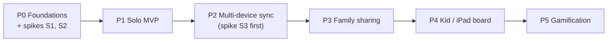

# 05 — Roadmap

**Status:** Draft (2026-09-29).

- Pace is open-ended, so phases have **exit criteria, not dates**.
- Sizes are relative: S, M, L.
- Every phase ends with the app in daily use. A phase is only done when it has held up in real use.

---

## Riskiest unknowns (spike first)

Each spike is **time-boxed**, has a clear pass/fail, and has a fallback. Throwaway code is fine.

| #      | Unknown                                                                                                                                                                                                                                                                                     | Before       | Pass looks like                                                                                                                       | If it fails                                                |
| ------ | ------------------------------------------------------------------------------------------------------------------------------------------------------------------------------------------------------------------------------------------------------------------------------------------- | ------------ | ------------------------------------------------------------------------------------------------------------------------------------- | ---------------------------------------------------------- |
| **S1** | **PowerSync in local-only mode as the P1 store.** Watch queries in SwiftUI. How schema changes reach installed apps. **Are writes made before sign-in uploaded after** `connect()`**, or must they be copied from local-only tables?** (PowerSync documents a pattern for the second case.) | P1           | A small app with 2 tables survives a schema change and an app relaunch. The answer to the sign-in question is known and written down. A P1 device that has a local profile, household, membership, slots, and tasks signs in and uploads cleanly under the planned RLS (architecture §5.2). A second device's pre-sign-in rows don't upload (domain model C8; also L11 once pairing returns). **Open:** do `households` and `memberships` live in local-only tables copied at sign-in, or does the connector clear their queued entries (architecture §5.3)? | ADR-001 sub-decision (ii): GRDB for P1, migrate in P2      |
| **S2** | **End-to-end sync, reduced, on the local stack** (Supabase CLI + PowerSync Open Edition in Docker, 06 §3): first sign-in from a device with P1 data (S1's sign-in checks); RLS rejecting an upload (domain model C11); sync streams driven by the JWT (account → profile → open membership → household), including the household's slots; a `deletedAt` soft delete; two simulators offline then reconnected, **upserting the same deterministic rule-version ID** (domain model C5); **rows changing buckets** (a task moving personal → household, and a profile joining another household); and two households side by side | P1           | Domain model C5 and C11 behave as documented. A soft-deleted row disappears from both devices. After a bucket change, the devices of both the old and new bucket converge, with nothing left behind or duplicated. Neither household downloads any of the other's rows. **Open:** does the stream lookup account → profile → open membership → household work? If not, `profileId` and `householdId` go into the JWT as claims. **Open:** which sync tools qualify as the fallback? The write-up answers it. | Revisit ADR-001 with a fallback that meets R4, e.g. another Postgres-based sync tool. If only bucket changes fail: model a scope change as copy + delete, like Import (DM-17). |
| **S3** | **Sign in with Apple → Supabase:** native ID token, revoking the token on account deletion (a fresh authorization code, exchanged and revoked by an Edge Function), the free tiers pausing and reactivating, and the `pg_dump` → S3 workflow                                                                                                                        | P2           | Sign-in on a real device. Deletion revokes the token. The backup restores into a throwaway local database (06 §7).                                       | Move to Supabase Pro earlier (ADR-002 B)                   |

S4 (rows changing buckets) is now part of S2. S5 (pairing) moved to [Later](#later-no-phase-yet) with FR-53. Neither ID is reused.

The **recurrence engine** is the heart of the app, but it isn't a *technical* unknown: it's pure code with a written specification. It's the first thing built in P1, tests first.

---

## P0 — Foundations *(S)*

| In                                                                                                                                                                 | Out                         |
| ------------------------------------------------------------------------------------------------------------------------------------------------------------------ | --------------------------- |
| Repository and the layout from architecture §2. The Xcode project with `Domain`, `Data`, and `Features` packages. **The two app variants** (Dev and Prod: bundle IDs, App Groups, icons, settings files, and schemes from 06 §2), with `<BUNDLE_PREFIX>` fixed in 06. The local Supabase stack and seed data (06 §3). CI running `swift test` on Domain. **Spikes S1 and S2**, both against the local stack. | Any UI beyond a placeholder |

**Exit:** CI is green on an empty Domain test. The Dev and Prod variants install side by side on one device. Spikes S1 and S2 have each been decided either way. Their outcomes, and S2's write-up with the fallback candidates, are recorded in a new ADR, because a failed spike changes ADR-001's decision and accepted ADRs aren't rewritten. The answers to the spikes' open checks are then edited into architecture §5.1 and §5.3.

---

## P1 — Solo MVP *(L)*

| In                                                                                                                                                                                                                                                                                                                                                            | Out                                                                                        |
| ------------------------------------------------------------------------------------------------------------------------------------------------------------------------------------------------------------------------------------------------------------------------------------------------------------------------------------------------------------- | ------------------------------------------------------------------------------------------ |
| A household of one created automatically. Default slots, which can be renamed and reordered. **Tasks with every P1 pattern and preset** (§5.1 and §5.6 of the domain model). Today view with carry-over warnings. Tick, untick, skip, snooze, and backfill (7 days). History with streaks and averages. A day-start setting. Local database in the app's own container (architecture §3). | Accounts, sync, household UI, widgets, notifications, yearly/seasonal tasks, the purge job |

**Build order:**

1. **Domain engine with tests E1–E6**
2. Repositories
3. Today view
4. Task editor
5. History

**Exit (the minimum that proves it works):**

- All the domain model's E1–E6 cases pass as unit tests.
- It's been in **daily personal use on one iPhone for 2 weeks** with no data loss, including across at least one schema change.

**Note:** apps installed on a device through a free Apple developer account expire after 7 days. Join the **paid Apple Developer Program** by the end of P1: TestFlight and Sign in with Apple (P2) need it anyway.

---

## P2 — Multi-device sync *(L)*

| In                                                                                                                                                                                                                                                                                                                                                                                                                                                                            | Out                                                              |
| ----------------------------------------------------------------------------------------------------------------------------------------------------------------------------------------------------------------------------------------------------------------------------------------------------------------------------------------------------------------------------------------------------------------------------------------------------------------------------- | ---------------------------------------------------------------- |
| **Spike S3.** The dev and prod Supabase projects and PowerSync instances. **The delivery pipeline from 06 §4:** PR checks, deploys to dev on merge, deploys to prod on a tag with approval, Xcode Cloud builds. The `app_config` table with the `min_supported_build` gate (06 §5). Migrations for the personal scope (profiles, households, memberships, slots, tasks, rule versions, actions) + RLS + triggers. The PowerSync `profile` bucket, plus the parts of the household buckets marked P2 in architecture §5.1: the household row, its slots, and my own membership. Sign in with Apple. `connect()`. The upload handler with error classification and `rejected_writes` (architecture §4.2). **Import or Discard** on a second device (domain model C8). **Account deletion** (FR-33, domain model §3.1): soft delete, token revocation through an Edge Function, and the account-deletion part of the purge job. Nightly backup to S3 with 30-day expiry, with failure alerts (06 §4). pgTAP tests for the personal RLS. The download isolation test, and the two-simulator conflict script, automated (architecture §7). | Household sharing, invites, the rest of the purge job (P3) |

**Exit:**

- iPhone and iPad, **both edited offline, converge** (a script of domain model C1–C7).
- Account deletion works end to end.
- **A restore from backup into a throwaway local database has been rehearsed once** (06 §7).
- At least one change has gone all the way from branch → Dev → Prod through the pipeline.
- Two weeks of use across two devices.

---

## P3 — Family sharing *(L)*

| In                                                                                                                                                                                                                                                                                                                                                                                                                | Out                                            |
| ----------------------------------------------------------------------------------------------------------------------------------------------------------------------------------------------------------------------------------------------------------------------------------------------------------------------------------------------------------------------------------------------------------------- | ---------------------------------------------- |
| Lifecycle functions, each taking the caller's `logicalDate`: invite (with capabilities and the code rules in domain model §2.4, shared as text or a QR code read by the in-app scanner), join, leave/remove with the slot remap, change capabilities, add and delete unlinked profiles, and change task scope (domain model §3.1). Invariants 1–4 in the database. Household tasks with `each` and `anyOf` assignment. The rest of the household buckets (architecture §5.1). Merged Today (FR-46). A simple household board (FR-47). The personal/household choice once there are 2 or more memberships (HH-03). The rest of the purge job (ADR-011), with the retention hook (domain model §2.10). pgTAP tests for the full RLS matrix. | Kid mode, pairing, rotation, celebrations, invite links |

**Exit:**

- **Two adults on separate Apple Accounts** have run a real household for 2 weeks.
- Domain model cases L1–L3, L6–L10, L13–L16, C2, C9, and C11 have been verified. (L4 and L5 need pairing, which is Later.)
- The RLS test matrix is green.
- The two-household download isolation test passes (architecture §7).

---

## P4 — Kid / iPad board *(M)*

| In                                                                                                                                                                                                                                                      | Out             |
| ------------------------------------------------------------------------------------------------------------------------------------------------------------------------------------------------------------------------------------------------------- | --------------- |
| Kid mode (FR-50): profile picker ("Who's playing?"), household tasks only, large tap targets, the parent PIN that guards leaving it (FR-51), and celebrations when a slot or day is complete (FR-52). | Points, rewards, pairing a kid's own device (Later) |

**Exit:** the kids tick their own routines on the shared iPad for 2 weeks without adult help, and kid mode can't be left, and no personal task or management action can be reached, without the PIN.

---

## P5 — Gamification *(M)*

| In                                                                                                                                                                                                     | Out                                                            |
| ------------------------------------------------------------------------------------------------------------------------------------------------------------------------------------------------------ | -------------------------------------------------------------- |
| Points per task (default 0). A `PointEntry` ledger written by a server trigger (each occurrence pays out at most once, net, and revoking adds a compensating entry; domain model §2.9). Rewards. Redemption as an online-only server function. A cooperative household goal. | Leaderboards (a non-goal), a persistent game layer (ADR-009 C) |

**Exit:**

- A weekly family goal has been reached and redeemed.
- For every profile, the ledger balance equals the points recomputed from actions.

---

## Later (no phase yet)

| Item                                              | Notes                                                  |
| ------------------------------------------------- | ------------------------------------------------------ |
| Yearly and seasonal tasks (FR-15)                 | Add a pattern. The engine's structure doesn't change.  |
| Rotation (FR-44)                                  | A new assignment mode in rule versions                 |
| Widgets, including interactive ones               | Move the local database into the App Group first (architecture §3) |
| Mac, Siri/Shortcuts                               | They reuse `Domain` and `Data`                         |
| Notifications (slot-start summaries)              | Need rescheduling whenever synced changes arrive       |
| Several households per person, merging households | Drop invariant 1's unique index, and decide which household's slots a personal task uses: its rule versions point at one household's slots. Then design the merge. |
| Automatic skip for days lost to time-zone jumps   | Replaces the manual repair in DM-08                    |
| Pairing a kid's own device (FR-53; domain model L4, L5, L11, L12) | **Spike S5 first:** anonymous auth + a redeem function, and whether an anonymous session survives app updates. Pass: a paired iPad keeps working across app updates and reboots. If it fails: pair the device with a family-owned Apple Account instead. Needs App Store distribution, because [TestFlight doesn't allow users under 13](https://www.apple.com/legal/internet-services/itunes/testflight/). Needs a `PairingCode` entity with the same rules as join codes (domain model §2.4) and an expiry measured in minutes. |
| Moving a household task to personal scope | *Change task scope* covers only personal → household (domain model §3.1) |
| Invite links (Universal Links) | Need a domain and hosting, which architecture §1 and 06 §9 don't include. P3 uses codes and QR codes. |

