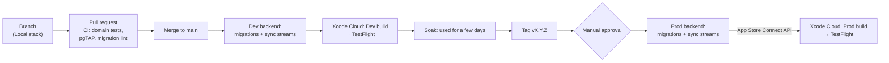

# 06 — Environments and release

**Status:** Current (2026-09-30).
**Rationale:** [ADR-012](02-decisions/ADR-012-environments-and-release.md).
**Read this when:** you're configuring builds, running the backend locally, writing a migration, changing sync streams, releasing, handling test data, or turning the backend off.

Names written like `<BUNDLE_PREFIX>` are fixed in P0 and then filled in here.

---

## 1. Environments

|              | **Local**                                                                       | **Dev**                                                         | **Prod**                                                          |
| ------------ | ------------------------------------------------------------------------------- | --------------------------------------------------------------- | ----------------------------------------------------------------- |
| Purpose      | Everyday coding                                                                 | Trying finished changes on real devices                         | Real family use                                                   |
| Backend      | Supabase CLI (Docker) + PowerSync Open Edition (Docker)                         | Supabase project `taskorganizer-dev` + PowerSync instance `dev` | Supabase project `taskorganizer-prod` + PowerSync instance `prod` |
| App variant  | Debug build from Xcode                                                          | **Task Organizer Dev** (orange icon)                            | **Task Organizer**                                                |
| Bundle ID    | `<BUNDLE_PREFIX>.taskorganizer.dev`                                             | `<BUNDLE_PREFIX>.taskorganizer.dev`                             | `<BUNDLE_PREFIX>.taskorganizer`                                   |
| App Group    | `group.<BUNDLE_PREFIX>.taskorganizer.dev`                                       | same as Local                                                   | `group.<BUNDLE_PREFIX>.taskorganizer`                             |
| Installed by | Xcode, on the simulator (a physical device can't reach `localhost`, so use Dev) | TestFlight                                                      | TestFlight (ADR-012 E-4)                                          |
| Data         | Seed scripts, reset at will                                                     | Seed scripts plus whatever gets typed in while testing          | Real data. **Never copied anywhere else**, except as §7 lists.                        |
| Region       | —                                                                               | `us-east-1`                                                     | `us-east-1`                                                       |

**Invariants:**

- **Each variant has its own bundle ID, and so its own app container.** The local database lives in the app's own container (architecture §3), so the bundle IDs are what keep dev data and real data physically apart. Each variant also has its own App Group, for widgets later.
- Local and Dev share a variant, because only a Debug build from Xcode can point at `localhost`. **The local database's filename includes the backend environment** (Local, Dev, or Prod: the `BACKEND_ENV` key, §2), so Local and Dev builds on one simulator never share a database or an upload queue.
- The Sign in with Apple configuration lists both bundle IDs. Each environment's Supabase project only accepts its own.

---

## 2. Build configuration

| Xcode build configuration | Scheme                | Settings file           | Variant | Backend |
| ------------------------- | --------------------- | ----------------------- | ------- | ------- |
| `Debug-Local`             | TaskOrganizer (Local) | `Config/Local.xcconfig` | Dev     | Local   |
| `Debug-Dev`               | TaskOrganizer (Dev)   | `Config/Dev.xcconfig`   | Dev     | Dev     |
| `Release-Dev`             | TaskOrganizer (Dev)   | `Config/Dev.xcconfig`   | Dev     | Dev     |
| `Release-Prod`            | TaskOrganizer (Prod)  | `Config/Prod.xcconfig`  | Prod    | Prod    |

**Keys in each settings file**, exposed to code through `Info.plist` and read in one place in `App`:

| Key                 | Notes                                               |
| ------------------- | --------------------------------------------------- |
| `BUNDLE_ID`         |                                                     |
| `APP_DISPLAY_NAME`  |                                                     |
| `APP_ICON_NAME`     |                                                     |
| `APP_GROUP_ID`      |                                                     |
| `SUPABASE_URL`      |                                                     |
| `SUPABASE_PUBLISHABLE_KEY` | The `sb_publishable_…` key, not the legacy `anon` key, which Supabase is [retiring by the end of 2026](https://supabase.com/docs/guides/getting-started/migrating-to-new-api-keys). Public by design; RLS protects the data. Committed. |
| `POWERSYNC_URL`     |                                                     |
| `BACKEND_ENV`       | `Local`, `Dev`, or `Prod`. Names the local database file (§1). |
| `FEATURE_*`         | See §6                                              |

**Secrets:**

- The secret key (`sb_secret_…`, not the legacy `service_role` key), database passwords, AWS credentials, and the App Store Connect API key (§4) live only in GitHub Actions secrets or Xcode Cloud environment variables.
- The Sign in with Apple `.p8` key lives only as a Supabase secret in each project, for the Edge Function that revokes tokens (architecture §5.3). It's set once per project by hand, with `supabase secrets set`, not by CI.
- **They never go into the repo or the app.**

---

## 3. Local stack

| Task                              | How                                                                                                                                                          |
| --------------------------------- | ------------------------------------------------------------------------------------------------------------------------------------------------------------ |
| Start                             | `supabase start` in `backend/`, then `docker compose up` in `backend/powersync/`                                                                             |
| Reset the database with seed data | `supabase db reset`. It re-runs every migration, then `supabase/seed.sql`.                                                                                   |
| Run the backend tests             | `supabase test db` (pgTAP)                                                                                                                                   |
| Run the domain tests              | `swift test` in `ios/Packages/Domain`                                                                                                                        |
| Seed data                         | Deterministic: named example profiles (Alice, Bob, Carol, Dave), one household, and one task per preset. It's the same set used by the domain tests' fixtures. |

---

## 4. How a change travels to Prod

| Stage             | Trigger                                                      | Runs on                      | Runs                                                                                                         |
| ----------------- | ------------------------------------------------------------ | ---------------------------- | ------------------------------------------------------------------------------------------------------------ |
| Pull request      | push to a PR                                                 | GitHub Actions (Linux)       | Domain tests, `supabase db lint`, the migration check (§5), pgTAP against a local Supabase                   |
| Dev deploy        | merge to `main`                                              | GitHub Actions + Xcode Cloud | `supabase db push` and `supabase functions deploy` to dev, sync streams to the dev PowerSync instance, then a Dev build to TestFlight        |
| Prod deploy       | a `v*` tag, **after manual approval** (a GitHub environment) | GitHub Actions + Xcode Cloud | **Backend first:** `supabase db push` and `supabase functions deploy` to prod, and sync streams to prod. **Then** the same job starts the Xcode Cloud Prod workflow through the App Store Connect API ([`POST /v1/ciBuildRuns`](https://developer.apple.com/documentation/appstoreconnectapi/post-v1-cibuildruns), with the tag as `sourceBranchOrTag`), which builds to TestFlight. |
| Keep builds fresh | Monthly schedule                                             | GitHub Actions + Xcode Cloud | A scheduled GitHub Action starts the Prod workflow on the latest Prod tag, through the same API call, because TestFlight builds expire after 90 days. Xcode Cloud's own schedules [can only build a branch](https://developer.apple.com/documentation/xcode/configuring-start-conditions). |
| Backup            | Nightly                                                      | GitHub Actions               | `pg_dump` prod → S3, which expires files after 30 days (ADR-011). Connects through the shared **pooler** connection string, which is IPv4: the direct connection is IPv6-only without a paid add-on, and GitHub-hosted runners are IPv4-only ([Supabase](https://supabase.com/docs/guides/database/connecting-to-postgres)). |

- **The Prod workflow's start condition is Manual Start for `v*` tags**, not Tag Changes. [Tag Changes](https://developer.apple.com/documentation/xcode/configuring-start-conditions) would start a build as soon as a tag is created, before the approval.
- **An alert fires when the backup job fails, or when it stops running.** GitHub [disables scheduled workflows](https://docs.github.com/en/actions/how-tos/manage-workflow-runs/disable-and-enable-workflows) in a public repository after 60 days without activity.

**Before P2** there's no backend and no Xcode Cloud yet. Builds are archived by hand in Xcode and uploaded to TestFlight once the developer program is active (ADR-012 E-3).

---

## 5. Backward compatibility rules

These apply to **every** backend change, because older app builds and offline queued writes keep reaching the server.

| Change                                         | Allowed?      | How                                                                                                                                                                                                                      |
| ---------------------------------------------- | ------------- | ------------------------------------------------------------------------------------------------------------------------------------------------------------------------------------------------------------------------ |
| Add a table, or a nullable or defaulted column | ✅             | In one step                                                                                                                                                                                                              |
| Add a NOT NULL column                          | ⚠️            | Add it with a default, backfill, then tighten in a later release                                                                                                                                                         |
| Rename or drop a column or table               | ❌ in one step | **Expand, then contract:** (1) add the new one, and write to both if needed; (2) ship an app that uses only the new one; (3) new builds keep a map of renamed and dropped columns, and rewrite queued operations still in the old shape before uploading them; (4) raise `min_supported_build` past the last build that uses the old one; (5) drop the old one |
| Tighten an RLS policy or constraint            | ⚠️            | Old clients' writes will be rejected permanently and moved to `rejected_writes` (architecture §4.2). Only do this together with a `min_supported_build` bump.                                                             |
| Change sync streams                            | ✅ if additive | Removing a column from a bucket is a contract step                                                                                                                                                                       |
| Change the client (PowerSync) schema           | Additive only | New columns are optional in Swift. Nothing is removed until a contract release.                                                                                                                                          |

**The migration check:** `supabase db lint` doesn't enforce this table, so a PR check flags `DROP`, `RENAME`, and `SET NOT NULL` in new migrations (§4).

**The** `min_supported_build` **gate:**

- A server table `app_config(platform, min_supported_build, message)`.
- The app checks it at launch and before `connect()`.
- If the app's build number is lower, the app **keeps working locally but stops syncing**, and shows the message ("Please update").
- It's raised only as step 4 of a contract.

---

## 6. Versions and feature flags

| Item              | Rule                                                                                                                                                                        |
| ----------------- | --------------------------------------------------------------------------------------------------------------------------------------------------------------------------- |
| Marketing version | `MAJOR.MINOR.PATCH`. MINOR goes up per phase milestone, PATCH for fixes.                                                                                                    |
| Build number      | A single number that only ever goes up, shared by both variants. Set by CI (Xcode Cloud's `CI_BUILD_NUMBER`). **Open until P2 pipeline setup** (forum reports only, not documented behavior): does Xcode Cloud keep a separate build-number sequence per product? That would be harmless, because each backend gates its own variant. And can a build be published under the wrong bundle ID when a configuration changes it? Try both variants in the pipeline before relying on either. |
| Git tags          | `vX.Y.Z` on the commit that goes to Prod                                                                                                                                    |
| Migrations        | Timestamped files from the Supabase CLI. Never edited once merged.                                                                                                          |
| Feature flags     | Compile-time `FEATURE_*` keys in the settings files: on in Dev, off in Prod until the feature is ready. A flag is deleted once its feature ships. Remote flags aren't used. |

---

## 7. Test data policy

- **Prod data never leaves Prod**, except the S3 backup, the off switch's final dump (§10), and the rehearsal container. It includes children's data. No dumps into Dev or Local, and no screenshots of it in issues.
- **Dev and Local use seed data only.**
- **Backup restore rehearsals** load a prod backup into a **throwaway local Postgres container**, verify it, and destroy the container.
- **After any restore of Prod from a backup, run the purge again**, so accounts purged since the backup was taken stay purged (domain model §2.10).

---

## 8. Distribution

| Who                           | How                                                                        | Notes                                                                                                                                                            |
| ----------------------------- | -------------------------------------------------------------------------- | ---------------------------------------------------------------------------------------------------------------------------------------------------------------- |
| The developer                 | Xcode (Local), TestFlight (Dev and Prod)                                   | Both variants installed side by side                                                                                                                             |
| Other adults in the household | TestFlight internal tester (an App Store Connect user with a minimal role) | Gets Prod, and optionally Dev                                                                                                                                    |
| Kids                          | Nothing to install                                                         | The shared iPad uses a parent's Apple Account (B4). |

---

## 9. Costs

$0 beyond the Apple Developer Program.

| Service        | Tier                       | Notes                                                                                  |
| -------------- | -------------------------- | -------------------------------------------------------------------------------------- |
| Supabase       | Free, 2 projects           | Dev and prod. The dev project pauses after 7 idle days; restore it from the dashboard. |
| PowerSync      | Free, 2 instances          | Dev and prod                                                                           |
| Xcode Cloud    | 25 hours a month, included |                                                                                        |
| GitHub Actions | Free                       | Linux runners only                                                                     |
| S3             | A few cents a month        | Backups                                                                                |

---

## 10. Off switch

To turn the backend off for a while (R2):

1. Purge every account still in its 30-day deletion window now. Nobody can sign back in to cancel while the backend is off, and otherwise the final dump would keep data the app promised to erase within 60 days (FR-33).
2. Take a final `pg_dump`, and store it where the 30-day expiry rule doesn't apply.
3. Disable the backup job. Otherwise it fails every night against the paused project, and Supabase doesn't document whether a dump counts as the activity that prevents auto-pause.
4. Pause PowerSync and Supabase together. An idle replication slot keeps holding WAL until Supabase's 4 GB cap, and past that PowerSync has to [re-replicate from scratch](https://docs.powersync.com/maintenance-ops/replication-lag).

A paused free project can be restored from the dashboard for [up to 1 year](https://supabase.com/docs/guides/platform/free-project-pausing). After that, only the final dump is left. After restoring from it, run the purge again (§7).

