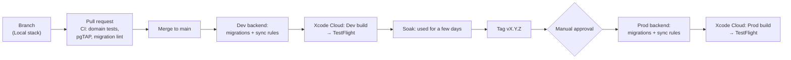

# 06 — Environments and release

**Status:** Current (2026-09-30).
**Rationale:** [ADR-012](02-decisions/ADR-012-environments-and-release.md).
**Read this when:** you're configuring builds, running the backend locally, writing a migration, changing sync rules, releasing, or handling test data.

Names written like `<BUNDLE_PREFIX>` are fixed in P0 and then filled in here.

---

## 1. Environments

|              | **Local**                                                                       | **Dev**                                                         | **Prod**                                                          |
| ------------ | ------------------------------------------------------------------------------- | --------------------------------------------------------------- | ----------------------------------------------------------------- |
| Purpose      | Everyday coding                                                                 | Trying finished changes on real devices                         | Real family use                                                   |
| Backend      | Supabase CLI (Docker) + PowerSync Open Edition (Docker)                         | Supabase project `taskorganizer-dev` + PowerSync instance `dev` | Supabase project `taskorganizer-prod` + PowerSync instance `prod` |
| App variant  | Debug build from Xcode                                                          | **Task Organizer Dev** (orange icon)                            | **Task Organizer**                                                |
| Bundle ID    | `<BUNDLE_PREFIX>.taskorganizer.dev`                                             | `<BUNDLE_PREFIX>.taskorganizer.dev`                             | `<BUNDLE_PREFIX>.taskorganizer`                                   |
| App Group    | `group.<BUNDLE_PREFIX>.taskorganizer.dev`                                       | same as Local                                                   | `group.<BUNDLE_PREFIX>.taskorganizer`                             |
| Installed by | Xcode, on the simulator (a physical device can't reach `localhost`, so use Dev) | TestFlight                                                      | TestFlight (ADR-012 E-4)                                          |
| Data         | Seed scripts, reset at will                                                     | Seed scripts plus whatever gets typed in while testing          | Real data. **Never copied anywhere else.**                        |
| Region       | —                                                                               | `us-east-1`                                                     | `us-east-1`                                                       |

**Invariants:**

- **Each variant has its own bundle ID and its own App Group.** The local database lives in the App Group (architecture §3), so this is what keeps dev data and real data physically apart.
- Local and Dev share a variant, because only a Debug build from Xcode can point at `localhost`.
- The Sign in with Apple configuration lists both bundle IDs. Each environment's Supabase project only accepts its own.

---

## 2. Build configuration

| Xcode build configuration | Scheme                | Settings file           | Variant | Backend |
| ------------------------- | --------------------- | ----------------------- | ------- | ------- |
| `Debug-Local`             | TaskOrganizer (Local) | `Config/Local.xcconfig` | Dev     | Local   |
| `Debug-Dev`               | TaskOrganizer (Dev)   | `Config/Dev.xcconfig`   | Dev     | Dev     |
| `Release-Dev`             | TaskOrganizer (Dev)   | `Config/Dev.xcconfig`   | Dev     | Dev     |
| `Release-Prod`            | TaskOrganizer (Prod)  | `Config/Prod.xcconfig`  | Prod    | Prod    |

**Keys in each settings file**, exposed to code through `Info.plist` and read in one place in `App`:

| Key                 | Notes                                               |
| ------------------- | --------------------------------------------------- |
| `BUNDLE_ID`         |                                                     |
| `APP_DISPLAY_NAME`  |                                                     |
| `APP_ICON_NAME`     |                                                     |
| `APP_GROUP_ID`      |                                                     |
| `SUPABASE_URL`      |                                                     |
| `SUPABASE_ANON_KEY` | Public by design; RLS protects the data. Committed. |
| `POWERSYNC_URL`     |                                                     |
| `FEATURE_*`         | See §6                                              |

**Secrets:**

- The service role key, database passwords, and AWS credentials live only in GitHub Actions secrets or Xcode Cloud environment variables.
- **They never go into the repo or the app.**

---

## 3. Local stack

| Task                              | How                                                                                                                                                          |
| --------------------------------- | ------------------------------------------------------------------------------------------------------------------------------------------------------------ |
| Start                             | `supabase start` in `backend/`, then `docker compose up` in `backend/powersync/`                                                                             |
| Reset the database with seed data | `supabase db reset`. It re-runs every migration, then `supabase/seed.sql`.                                                                                   |
| Run the backend tests             | `supabase test db` (pgTAP)                                                                                                                                   |
| Run the domain tests              | `swift test` in `ios/Packages/Domain`                                                                                                                        |
| Seed data                         | Deterministic: named example profiles (Victor, Ana, Leo, Mia), one household, and one task per preset. It's the same set used by the domain tests' fixtures. |

---

## 4. How a change travels to Prod

| Stage             | Trigger                                                      | Runs on                      | Runs                                                                                                         |
| ----------------- | ------------------------------------------------------------ | ---------------------------- | ------------------------------------------------------------------------------------------------------------ |
| Pull request      | push to a PR                                                 | GitHub Actions (Linux)       | Domain tests, `supabase db lint`, pgTAP against a local Supabase                                             |
| Dev deploy        | merge to `main`                                              | GitHub Actions + Xcode Cloud | `supabase db push` to dev, sync rules to the dev PowerSync instance, then a Dev build to TestFlight          |
| Prod deploy       | a `v*` tag, **after manual approval** (a GitHub environment) | GitHub Actions + Xcode Cloud | **Backend first:** `supabase db push` to prod and sync rules to prod. **Then** the Prod build to TestFlight. |
| Keep builds fresh | Monthly schedule                                             | Xcode Cloud                  | Rebuilds the latest Prod tag, because TestFlight builds expire after 90 days                                 |
| Backup            | Nightly                                                      | GitHub Actions               | `pg_dump` prod → S3, which expires files after 30 days (ADR-011)                                             |

**Before P2** there's no backend and no Xcode Cloud yet. Builds are archived by hand in Xcode and uploaded to TestFlight once the developer program is active (ADR-012 E-3).

---

## 5. Backward compatibility rules

These apply to **every** backend change, because older app builds and offline queued writes keep reaching the server.

| Change                                         | Allowed?      | How                                                                                                                                                                                                                      |
| ---------------------------------------------- | ------------- | ------------------------------------------------------------------------------------------------------------------------------------------------------------------------------------------------------------------------ |
| Add a table, or a nullable or defaulted column | ✅             | In one step                                                                                                                                                                                                              |
| Add a NOT NULL column                          | ⚠️            | Add it with a default, backfill, then tighten in a later release                                                                                                                                                         |
| Rename or drop a column or table               | ❌ in one step | **Expand, then contract:** (1) add the new one, and write to both if needed; (2) ship an app that uses only the new one; (3) raise `min_supported_build` past the last build that uses the old one; (4) drop the old one |
| Tighten an RLS policy or constraint            | ⚠️            | Old clients' writes will be rejected permanently and dropped (architecture §4.2). Only do this together with a `min_supported_build` bump.                                                                               |
| Change sync rules                              | ✅ if additive | Removing a column from a bucket is a contract step                                                                                                                                                                       |
| Change the client (PowerSync) schema           | Additive only | New columns are optional in Swift. Nothing is removed until a contract release.                                                                                                                                          |

**The** `min_supported_build` **gate:**

- A server table `app_config(platform, min_supported_build, message)`.
- The app checks it at launch and before `connect()`.
- If the app's build number is lower, the app **keeps working locally but stops syncing**, and shows the message ("Please update").
- It's raised only as step 3 of a contract.

---

## 6. Versions and feature flags

| Item              | Rule                                                                                                                                                                        |
| ----------------- | --------------------------------------------------------------------------------------------------------------------------------------------------------------------------- |
| Marketing version | `MAJOR.MINOR.PATCH`. MINOR goes up per phase milestone, PATCH for fixes.                                                                                                    |
| Build number      | A single number that only ever goes up, shared by both variants. Set by CI (Xcode Cloud's `CI_BUILD_NUMBER`).                                                               |
| Git tags          | `vX.Y.Z` on the commit that goes to Prod                                                                                                                                    |
| Migrations        | Timestamped files from the Supabase CLI. Never edited once merged.                                                                                                          |
| Feature flags     | Compile-time `FEATURE_*` keys in the settings files: on in Dev, off in Prod until the feature is ready. A flag is deleted once its feature ships. Remote flags aren't used. |

---

## 7. Test data policy

- **Prod data never leaves Prod.** It includes children's data. No dumps into Dev or Local, and no screenshots of it in issues.
- **Dev and Local use seed data only.**
- **Backup restore rehearsals** load a prod backup into a **throwaway local Postgres container**, verify it, and destroy the container.

---

## 8. Distribution

| Who                           | How                                                                        | Notes                                                                                                                                                            |
| ----------------------------- | -------------------------------------------------------------------------- | ---------------------------------------------------------------------------------------------------------------------------------------------------------------- |
| The developer                 | Xcode (Local), TestFlight (Dev and Prod)                                   | Both variants installed side by side                                                                                                                             |
| Other adults in the household | TestFlight internal tester (an App Store Connect user with a minimal role) | Gets Prod, and optionally Dev                                                                                                                                    |
| Kids                          | Nothing to install                                                         | The shared iPad uses a parent's Apple Account (B4). Paired kid devices (P4+) get the app through the parent's TestFlight invite, or later through the App Store. |

---

## 9. Costs

$0 beyond the Apple Developer Program.

| Service        | Tier                       | Notes                                                                                  |
| -------------- | -------------------------- | -------------------------------------------------------------------------------------- |
| Supabase       | Free, 2 projects           | Dev and prod. The dev project pauses after 7 idle days; restore it from the dashboard. |
| PowerSync      | Free, 2 instances          | Dev and prod                                                                           |
| Xcode Cloud    | 25 hours a month, included |                                                                                        |
| GitHub Actions | Free                       | Linux runners only                                                                     |
| S3             | A few cents a month        | Backups                                                                                |

